# MrWebDefence 詳細設計書

## 1. 詳細設計の観点リスト

本システムの詳細設計を作成する際の観点を以下に整理します。

### 1.1 システムアーキテクチャ設計
- [ ] システム全体アーキテクチャ
  - コンポーネント間の関係性
  - データフロー
  - 通信プロトコル
  - セキュリティ境界
- [ ] マイクロサービス/モノリスの選択と設計
- [ ] サービス間通信設計（REST API、メッセージキュー等）
- [ ] イベント駆動アーキテクチャの設計（必要に応じて）

### 1.2 データベース設計
- [ ] ER図（エンティティ関係図）
- [ ] テーブル定義書
  - 全テーブルの詳細定義（カラム名、型、制約、インデックス）
  - 外部キー制約
  - ユニーク制約
- [ ] データベース正規化設計
- [ ] インデックス戦略
- [ ] パーティショニング戦略（必要に応じて）
- [ ] データベースマイグレーション設計（Flyway）
- [ ] バックアップ・リストア設計

### 1.3 API設計
- [ ] OpenAPI仕様書（Swagger）
  - 全エンドポイントの詳細定義
  - リクエスト/レスポンススキーマ
  - エラーレスポンス定義
  - 認証・認可の定義
- [ ] APIバージョニング戦略
- [ ] APIエラーハンドリング設計
- [ ] APIレート制限設計（現状は不要だが将来拡張用）
- [ ] APIドキュメント生成方法

### 1.4 認証・認可設計
- [ ] 認証方式の詳細設計
  - セッション管理
  - JWT/セッションクッキーの選択
  - パスワードハッシュ化方式
- [ ] MFA（多要素認証）の詳細設計
  - TOTP実装詳細
  - バックアップコード管理
  - MFA設定フロー
- [ ] 認可設計（RBAC）
  - ロール定義
  - 権限マトリクス
  - リソース単位のアクセス制御
- [ ] IP AllowList機能の実装設計
- [ ] セッション管理設計
  - セッションタイムアウト
  - セッション無効化
  - セッションストレージ（Redis）

### 1.5 フロントエンド設計
- [ ] UI/UX設計
  - 画面遷移図
  - ワイヤーフレーム
  - コンポーネント設計
- [ ] 状態管理設計
  - グローバル状態管理
  - ローカル状態管理
- [ ] ルーティング設計
- [ ] フォームバリデーション設計
- [ ] エラーハンドリング設計
- [ ] レスポンシブデザイン（デスクトップのみ対応）
- [ ] アクセシビリティ設計
- [ ] 国際化対応（英語のみ）

### 1.6 バックエンド設計
- [ ] サービス層設計
  - 各サービスの責務定義
  - サービス間の依存関係
- [ ] ビジネスロジック設計
  - シグニチャグループ管理ロジック
  - シグニチャ検証ロジック
  - 通知ロジック
  - バッチ処理ロジック
- [ ] データアクセス層設計
  - Repository パターン
  - ORMマッピング
  - クエリ最適化
- [ ] トランザクション管理設計
- [ ] エラーハンドリング設計
- [ ] ロギング設計

### 1.7 WAFエンジン設計
- [ ] OpenAppSec統合設計
  - OpenAppSecとの連携方法
  - 設定の動的更新方法
  - 設定の配信方法
- [ ] Nginx設定設計
  - バーチャルホスト設定
  - SSL/TLS設定
  - ログ設定
- [ ] 設定管理設計
  - 設定の取得方法（API経由）
  - 設定のキャッシュ戦略
  - 設定のバージョン管理
- [ ] ログ転送設計
  - Fluentd設定
  - ログフォーマット
  - ログ転送のリトライロジック
- [ ] RateLimit実装設計
  - Redis連携
  - アルゴリズム実装（スライディングウィンドウ、トークンバケット）
  - 分散環境対応
- [ ] GeoIP機能実装設計
  - MaxMindDB統合
  - IP/CIDR判定ロジック
  - 国コード判定ロジック
- [ ] ヘルスチェック設計
- [ ] メトリクス収集設計（サイドカー方式）

### 1.8 ログ管理サーバ設計
- [ ] ログ収集設計
  - Fluentd/Fluent Bit設定
  - ログ受信エンドポイント設計
  - ログパース・正規化ロジック
- [ ] ログ保存設計
  - ローカルストレージ設計
  - ログインデックス化設計（必要に応じて）
  - ログ圧縮・アーカイブ設計
- [ ] ログ転送設計
  - 外部システムへの転送（S3、Splunk等）
  - 転送のリトライロジック
  - 転送の優先度管理
- [ ] ログ分析設計
  - 攻撃分析ロジック
  - 検知漏れ分析ロジック
  - 誤検知分析ロジック
  - 分析結果の保存方法
- [ ] ログ検索設計（後で決定）

### 1.9 シグニチャ収集機能設計
- [ ] シグニチャ生成設計
  - 商用WAF機能の分析ロジック
  - 脆弱性情報収集ロジック
  - シグニチャテンプレート設計
- [ ] シグニチャ検証設計
  - 過去ログとの照合ロジック
  - 誤検知率計算ロジック
  - 検知率計算ロジック
  - パフォーマンス影響評価ロジック
- [ ] バッチ処理設計
  - バッチスケジューリング設計
  - バッチ実行フロー
  - バッチのリトライロジック
  - バッチの失敗通知設計
- [ ] シグニチャ管理設計
  - シグニチャ候補プール管理
  - 承認ワークフロー設計
  - 自動削除ロジック（30日経過後）
- [ ] シグニチャグループ管理設計
  - グループ作成・編集・削除ロジック
  - 強制削除時の処理ロジック
  - 適用状態管理ロジック
  - 顧客別設定管理ロジック

### 1.10 通知機能設計
- [ ] 通知チャネル設計
  - メール通知
  - Slack通知
  - Webhook通知（拡張）
- [ ] 通知ルール設計
  - イベントタイプ定義
  - 優先度定義（Critical, Medium, Low）
  - 通知条件定義
- [ ] 通知重複防止設計
  - 重複防止期間の管理
  - 優先度の管理（顧客設定 > サービス設定 > デフォルト）
- [ ] 通知リトライ設計
  - 指数バックオフ実装
  - リトライ回数管理
  - 失敗記録
- [ ] 通知履歴管理設計

### 1.11 キャッシュ設計
- [ ] キャッシュ戦略設計
  - キャッシュ対象データ
  - キャッシュキー設計
  - TTL設定
- [ ] Redis設計
  - データ構造設計
  - 接続プール設計
  - クラスタリング設計（必要に応じて）
- [ ] キャッシュ無効化設計
  - データ更新時の無効化ロジック
  - キャッシュ更新戦略
- [ ] キャッシュ監視設計
  - 死活監視
  - 応答速度監視

### 1.12 バックアップ・リストア設計
- [ ] バックアップ戦略
  - バックアップスケジュール
  - バックアップ対象データ
  - バックアップ保存先（ローカル/リモート）
- [ ] バックアップ実装設計
  - ローカルバックアップ実装
  - AWS Aurora/RDS Snapshot連携設計
  - バックアップ暗号化設計
- [ ] バックアップ検証設計
  - ローカルバックアップのchecksum検証
  - リモートバックアップの存在確認
- [ ] リストア設計
  - リストア手順
  - リストア検証

### 1.13 監視・アラート設計
- [ ] 監視アーキテクチャ設計
  - サイドカー方式の実装詳細
  - Prometheus Exporter設計
  - Datadog Agent設計
- [ ] メトリクス設計
  - 収集メトリクス定義
  - メトリクスタグ設計
  - メトリクスアグリゲーション
- [ ] ログ監視設計
  - ログ収集方法
  - 異常パターン検知ロジック（ローカル環境）
- [ ] アラート設計
  - アラート条件定義
  - アラート通知先（監視プラットフォーム側で設定）

### 1.14 セキュリティ設計
- [ ] 通信セキュリティ設計
  - TLS/SSL設定
  - 証明書管理
- [ ] データセキュリティ設計
  - 機密情報の暗号化
  - パスワードハッシュ化
  - セッションデータの保護
- [ ] 入力検証設計
  - SQLインジェクション対策
  - XSS対策
  - CSRF対策
- [ ] 監査ログ設計
  - 監査ログの記録項目
  - 監査ログの保存方法
  - 監査ログの改ざん防止

### 1.15 デプロイメント設計
- [ ] Docker設計
  - Dockerfile設計
  - docker-compose設計
  - マルチステージビルド設計
- [ ] 環境変数・シークレット管理設計
  - 本番環境（Key管理システム連携）
  - ローカル環境（設定ファイル）
- [ ] イメージタグ付け戦略
  - commit IDタグ
  - latestタグ
  - リリースバージョンタグ
- [ ] CI/CD設計
  - GitHub Actionsワークフロー
  - ビルドパイプライン
  - テストパイプライン
  - デプロイパイプライン

### 1.16 テスト設計
- [ ] ユニットテスト設計
  - テストカバレッジ目標（80%以上）
  - テストフレームワーク選定
  - モック設計
- [ ] 統合テスト設計
  - ビッグバン型統合テスト設計
  - テストスクリプト設計
- [ ] E2Eテスト設計
  - E2Eテストシナリオ
  - E2Eテストフレームワーク選定
- [ ] パフォーマンステスト設計
  - WAFエンジンのパフォーマンステスト
  - 負荷テストシナリオ
- [ ] テスト環境設計
  - Local環境（Docker）
  - CI環境（GitHub Actions）
  - テストデータ管理

### 1.17 エラーハンドリング設計
- [ ] エラー分類設計
  - エラータイプ定義
  - エラーレベル定義
- [ ] エラーレスポンス設計
  - 統一エラーレスポンス形式
  - エラーメッセージ設計
- [ ] エラーロギング設計
  - エラーログの記録方法
  - エラートラッキング
- [ ] リトライ設計
  - リトライ戦略（指数バックオフ等）
  - リトライ回数管理

### 1.18 パフォーマンス設計
- [ ] データベース最適化設計
  - クエリ最適化
  - インデックス最適化
  - 接続プール最適化
- [ ] キャッシュ最適化設計
  - キャッシュヒット率向上
  - キャッシュサイズ管理
- [ ] 非同期処理設計
  - 非同期処理の適用箇所
  - ジョブキュー設計（必要に応じて）
- [ ] スケーラビリティ設計
  - 水平スケーリング設計
  - ロードバランシング設計

### 1.19 ドキュメント設計
- [ ] 詳細設計書の構成
  - モジュール単位の設計書
  - 設計書のテンプレート
- [ ] API仕様書設計
  - OpenAPI仕様書の構成
  - Swagger UI設定
- [ ] コードコメント設計
  - コメント規約
  - ドキュメント生成方法

### 1.20 運用設計
- [ ] ログローテーション設計
- [ ] アーカイブ設計
  - アーカイブ先（S3/ローカル）
  - アーカイブ形式（gz圧縮）
  - アーカイブ保持期間（1年）
- [ ] メンテナンス設計
  - メンテナンス手順
  - ダウンタイム最小化
- [ ] トラブルシューティング設計
  - よくある問題と対処法
  - デバッグ手順

## 2. 設計の優先順位

上記の観点について、実装の優先順位を以下に示します。

### 優先度：高（必須）
1. システムアーキテクチャ設計
2. データベース設計
3. API設計
4. 認証・認可設計
5. バックエンド設計
6. WAFエンジン設計
7. ログ管理サーバ設計
8. シグニチャ収集機能設計

### 優先度：中（重要）
9. フロントエンド設計
10. 通知機能設計
11. キャッシュ設計
12. バックアップ・リストア設計
13. 監視・アラート設計
14. セキュリティ設計
15. デプロイメント設計
16. テスト設計
17. エラーハンドリング設計
18. パフォーマンス設計

### 優先度：低（拡張・最適化）
19. ドキュメント設計
20. 運用設計

## 3. 詳細設計

以下、各項目の詳細設計を記載します。

---

## 3.1 システムアーキテクチャ設計

### 3.1.1 概要

MrWebDefenceシステムは、OpenAppSecをベースとしたWAFサービスを提供するマルチテナントシステムです。管理画面、WAFエンジン、ログ管理サーバ、シグニチャ収集機能の4つの主要コンポーネントで構成されます。

### 3.1.2 設計方針

- **モノリシックアーキテクチャ**: 初版はモノリシックアーキテクチャを採用し、将来のマイクロサービス化を考慮した設計
- **APIファースト**: フロントエンドとバックエンドはREST APIで疎結合
- **水平スケーリング対応**: WAFエンジンは水平スケーリング可能
- **セキュリティ境界の明確化**: 各コンポーネント間の通信はTLSで保護

### 3.1.3 システム全体アーキテクチャ

#### 3.1.3.1 コンポーネント構成

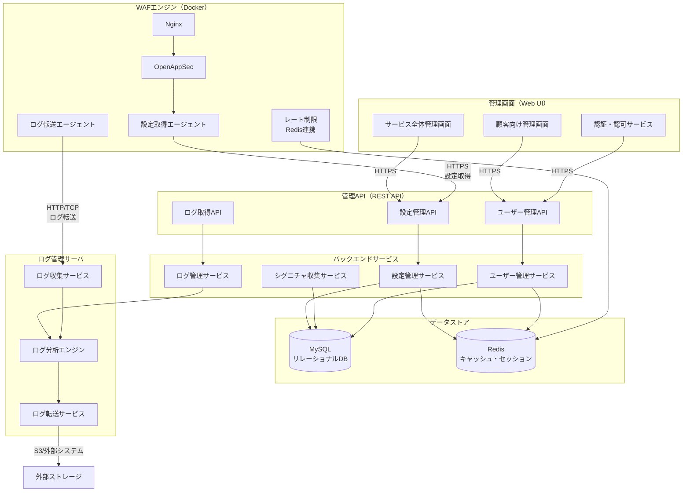
```mermaid
graph TB
    subgraph "管理画面（Web UI）"
        AdminUI[サービス全体管理画面]
        CustomerUI[顧客向け管理画面]
        AuthUI[認証・認可サービス]
    end

    subgraph "管理API（REST API）"
        ConfigAPI[設定管理API]
        UserAPI[ユーザー管理API]
        LogAPI[ログ取得API]
    end

    subgraph "バックエンドサービス"
        ConfigService[設定管理サービス]
        SignatureService[シグニチャ収集サービス]
        UserService[ユーザー管理サービス]
        LogService[ログ管理サービス]
    end

    subgraph "データストア"
        MySQL[(MySQL<br/>リレーショナルDB)]
        Redis[(Redis<br/>キャッシュ・セッション)]
    end

    subgraph "WAFエンジン（Docker）"
        Nginx[Nginx]
        OpenAppSec[OpenAppSec]
        ConfigAgent[設定取得エージェント]
        LogAgent[ログ転送エージェント]
        RateLimit[レート制限<br/>Redis連携]
    end

    subgraph "ログ管理サーバ"
        LogCollector[ログ収集サービス]
        LogAnalyzer[ログ分析エンジン]
        LogForwarder[ログ転送サービス]
    end

    AdminUI -->|HTTPS| ConfigAPI
    CustomerUI -->|HTTPS| UserAPI
    AuthUI -->|HTTPS| UserAPI

    ConfigAPI --> ConfigService
    UserAPI --> UserService
    LogAPI --> LogService

    ConfigService --> MySQL
    ConfigService --> Redis
    SignatureService --> MySQL
    UserService --> MySQL
    UserService --> Redis
    LogService --> LogAnalyzer

    ConfigAgent -->|HTTPS<br/>設定取得| ConfigAPI
    Nginx --> OpenAppSec
    OpenAppSec --> ConfigAgent
    LogAgent -->|HTTP/TCP<br/>ログ転送| LogCollector
    RateLimit --> Redis

    LogCollector --> LogAnalyzer
    LogAnalyzer --> LogForwarder
    LogForwarder -->|S3/外部システム| ExternalStorage[外部ストレージ]
```

#### 3.1.3.2 各コンポーネントの責務

##### 管理画面（Web UI）
- **サービス全体管理画面**: サービス管理者向けの管理機能を提供
  - 顧客管理、ユーザー管理、シグニチャグループ管理
  - システム設定、通知設定
- **顧客向け管理画面**: 顧客管理者・顧客メンバー向けの管理機能を提供
  - シグニチャグループ設定、ログ閲覧、FQDN管理
- **認証・認可サービス**: ユーザー認証とセッション管理を提供
  - ログイン、ログアウト、MFA設定

##### 管理API（REST API）
- **設定管理API**: WAFエンジン向けの設定配信API
  - シグニチャグループ設定の取得、FQDN設定の取得
- **ユーザー管理API**: ユーザー管理機能を提供
  - ユーザーCRUD、ロール管理、認証
- **ログ取得API**: ログ閲覧機能を提供
  - ログ検索、ログダウンロード

##### バックエンドサービス
- **設定管理サービス**: WAFエンジン向けの設定を管理
  - シグニチャグループの適用状態管理、設定のバージョン管理
- **シグニチャ収集サービス**: 新規シグニチャの生成・検証・承認を管理
  - シグニチャ候補の生成、検証バッチ実行、承認ワークフロー
- **ユーザー管理サービス**: ユーザーと顧客の管理
  - ユーザーCRUD、顧客CRUD、認証・認可ロジック
- **ログ管理サービス**: ログの取得・検索・ダウンロードを管理
  - ログ管理サーバとの連携、ログ検索、ログダウンロード

##### データストア
- **MySQL**: 永続的なデータを保存
  - ユーザー、顧客、シグニチャ、設定等のリレーショナルデータ
- **Redis**: 一時的なデータを保存
  - セッション情報、キャッシュ、レート制限カウンター

##### WAFエンジン（Docker）
- **Nginx**: WebサーバーとしてHTTPリクエストを処理
  - リバースプロキシ、SSL/TLS終端、ログ出力
- **OpenAppSec**: WAFエンジンとして攻撃を検知・ブロック
  - 機械学習ベースの攻撃検知、シグニチャベースの検知
- **設定取得エージェント**: 管理APIから設定を取得してOpenAppSecに適用
  - ポーリングまたはWebhookで設定を取得、設定ファイルの動的更新
- **ログ転送エージェント**: WAF検知ログをログ管理サーバに転送
  - Fluentdを使用したログ転送、リトライロジック
- **レート制限**: Redis連携によるレート制限機能
  - スライディングウィンドウ方式、分散環境対応

##### ログ管理サーバ
- **ログ収集サービス**: WAFエンジンからログを受信
  - Fluentd/Fluent Bitによるログ受信、ログパース・正規化
- **ログ分析エンジン**: ログを分析して攻撃パターンを検出
  - 攻撃分析、検知漏れ分析、誤検知分析
- **ログ転送サービス**: ログを外部システムに転送
  - S3へのアーカイブ、Splunk/Datadogへの転送（将来拡張）

#### 3.1.3.3 データフロー

##### 設定配信フロー

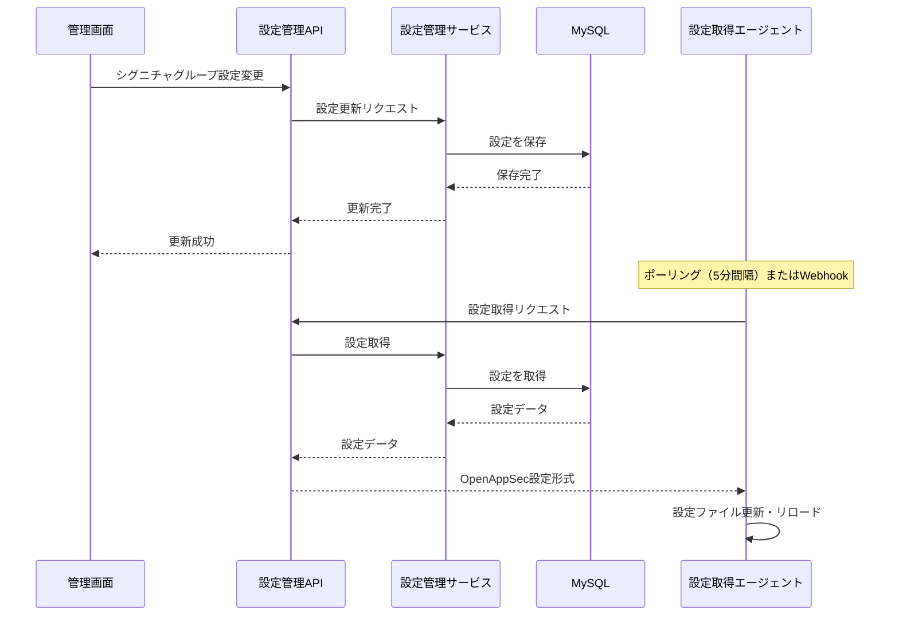
```mermaid
sequenceDiagram
    participant UI as 管理画面
    participant ConfigAPI as 設定管理API
    participant ConfigService as 設定管理サービス
    participant DB as MySQL
    participant ConfigAgent as 設定取得エージェント

    UI->>ConfigAPI: シグニチャグループ設定変更
    ConfigAPI->>ConfigService: 設定更新リクエスト
    ConfigService->>DB: 設定を保存
    DB-->>ConfigService: 保存完了
    ConfigService-->>ConfigAPI: 更新完了
    ConfigAPI-->>UI: 更新成功

    Note over ConfigAgent: ポーリング（5分間隔）またはWebhook
    ConfigAgent->>ConfigAPI: 設定取得リクエスト
    ConfigAPI->>ConfigService: 設定取得
    ConfigService->>DB: 設定を取得
    DB-->>ConfigService: 設定データ
    ConfigService-->>ConfigAPI: 設定データ
    ConfigAPI-->>ConfigAgent: OpenAppSec設定形式
    ConfigAgent->>ConfigAgent: 設定ファイル更新・リロード
```

##### ログ転送フロー

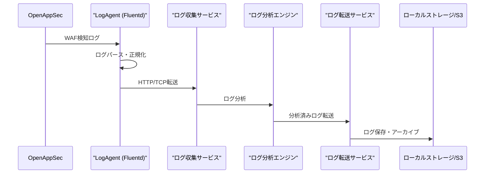
```mermaid
sequenceDiagram
    participant OpenAppSec as OpenAppSec
    participant LogAgent as "LogAgent (Fluentd)"
    participant LogCollector as "ログ収集サービス"
    participant LogAnalyzer as "ログ分析エンジン"
    participant LogForwarder as "ログ転送サービス"
    participant Storage as ローカルストレージ/S3

    OpenAppSec->>LogAgent: WAF検知ログ
    LogAgent->>LogAgent: ログパース・正規化
    LogAgent->>LogCollector: HTTP/TCP転送
    LogCollector->>LogAnalyzer: ログ分析
    LogAnalyzer->>LogForwarder: 分析済みログ転送
    LogForwarder->>Storage: ログ保存・アーカイブ
```

##### ログ取得フロー

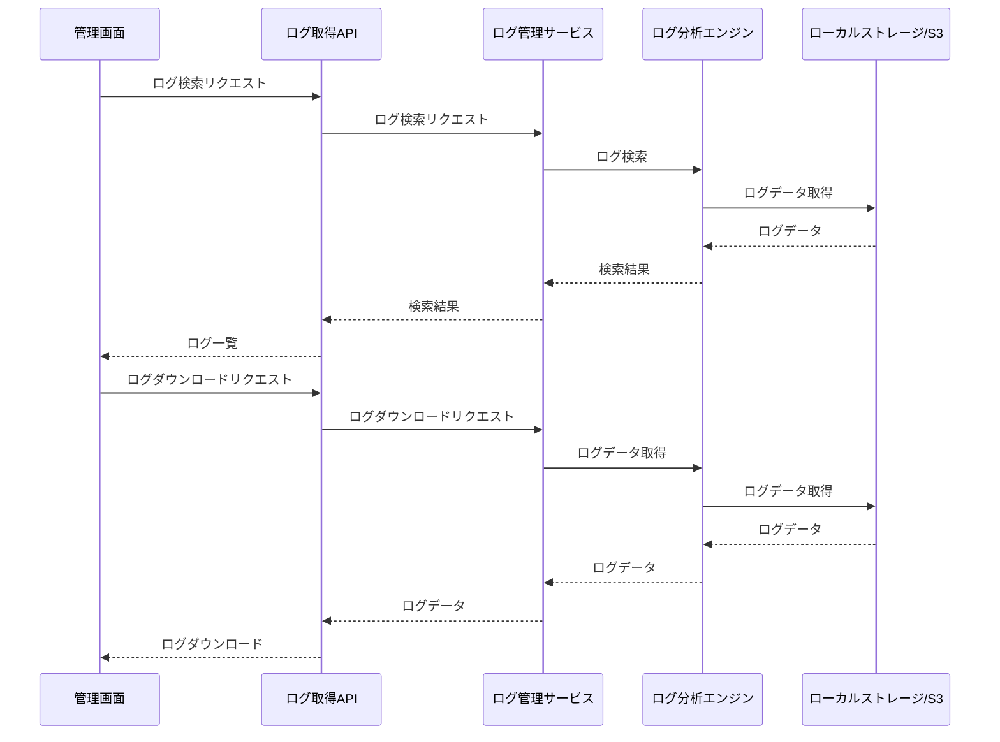
```mermaid
sequenceDiagram
    participant UI as 管理画面
    participant LogAPI as ログ取得API
    participant LogService as ログ管理サービス
    participant LogAnalyzer as ログ分析エンジン
    participant Storage as ローカルストレージ/S3

    UI->>LogAPI: ログ検索リクエスト
    LogAPI->>LogService: ログ検索リクエスト
    LogService->>LogAnalyzer: ログ検索
    LogAnalyzer->>Storage: ログデータ取得
    Storage-->>LogAnalyzer: ログデータ
    LogAnalyzer-->>LogService: 検索結果
    LogService-->>LogAPI: 検索結果
    LogAPI-->>UI: ログ一覧

    UI->>LogAPI: ログダウンロードリクエスト
    LogAPI->>LogService: ログダウンロードリクエスト
    LogService->>LogAnalyzer: ログデータ取得
    LogAnalyzer->>Storage: ログデータ取得
    Storage-->>LogAnalyzer: ログデータ
    LogAnalyzer-->>LogService: ログデータ
    LogService-->>LogAPI: ログデータ
    LogAPI-->>UI: ログダウンロード
```

##### 認証フロー

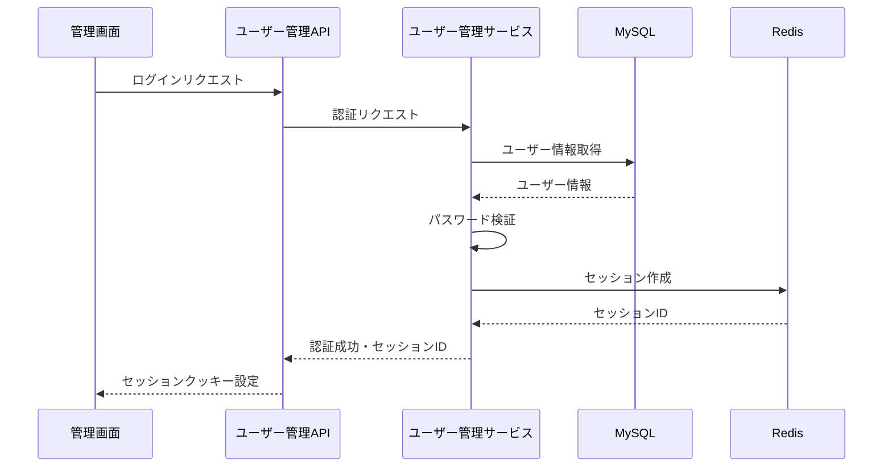
```mermaid
sequenceDiagram
    participant UI as 管理画面
    participant UserAPI as ユーザー管理API
    participant UserService as ユーザー管理サービス
    participant DB as MySQL
    participant Redis as Redis

    UI->>UserAPI: ログインリクエスト
    UserAPI->>UserService: 認証リクエスト
    UserService->>DB: ユーザー情報取得
    DB-->>UserService: ユーザー情報
    UserService->>UserService: パスワード検証
    UserService->>Redis: セッション作成
    Redis-->>UserService: セッションID
    UserService-->>UserAPI: 認証成功・セッションID
    UserAPI-->>UI: セッションクッキー設定
```

##### シグニチャ収集フロー

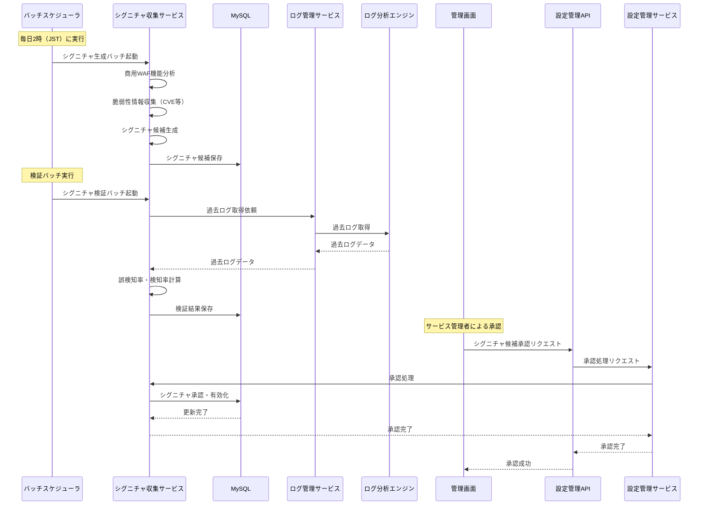
```mermaid
sequenceDiagram
    participant Batch as バッチスケジューラ
    participant SigService as シグニチャ収集サービス
    participant DB as MySQL
    participant LogService as ログ管理サービス
    participant LogAnalyzer as ログ分析エンジン
    participant UI as 管理画面
    participant ConfigAPI as 設定管理API
    participant ConfigService as 設定管理サービス

    Note over Batch: 毎日2時（JST）に実行
    Batch->>SigService: シグニチャ生成バッチ起動
    SigService->>SigService: 商用WAF機能分析
    SigService->>SigService: 脆弱性情報収集（CVE等）
    SigService->>SigService: シグニチャ候補生成
    SigService->>DB: シグニチャ候補保存

    Note over Batch: 検証バッチ実行
    Batch->>SigService: シグニチャ検証バッチ起動
    SigService->>LogService: 過去ログ取得依頼
    LogService->>LogAnalyzer: 過去ログ取得
    LogAnalyzer-->>LogService: 過去ログデータ
    LogService-->>SigService: 過去ログデータ
    SigService->>SigService: 誤検知率・検知率計算
    SigService->>DB: 検証結果保存

    Note over UI: サービス管理者による承認
    UI->>ConfigAPI: シグニチャ候補承認リクエスト
    ConfigAPI->>ConfigService: 承認処理リクエスト
    ConfigService->>SigService: 承認処理
    SigService->>DB: シグニチャ承認・有効化
    DB-->>SigService: 更新完了
    SigService-->>ConfigService: 承認完了
    ConfigService-->>ConfigAPI: 承認完了
    ConfigAPI-->>UI: 承認成功
```

##### レート制限フロー

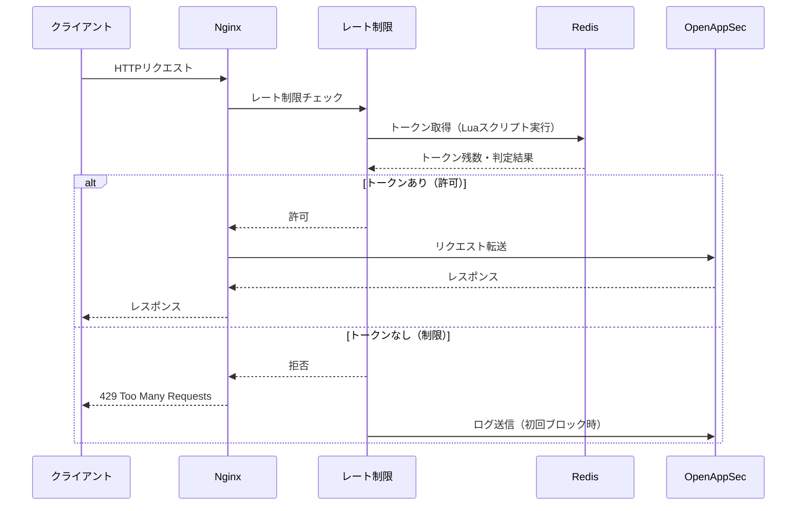
```mermaid
sequenceDiagram
    participant Client as クライアント
    participant Nginx as Nginx
    participant RateLimit as レート制限
    participant Redis as Redis
    participant OpenAppSec as OpenAppSec

    Client->>Nginx: HTTPリクエスト
    Nginx->>RateLimit: レート制限チェック
    RateLimit->>Redis: トークン取得（Luaスクリプト実行）
    Redis-->>RateLimit: トークン残数・判定結果
    alt トークンあり（許可）
        RateLimit-->>Nginx: 許可
        Nginx->>OpenAppSec: リクエスト転送
        OpenAppSec-->>Nginx: レスポンス
        Nginx-->>Client: レスポンス
    else トークンなし（制限）
        RateLimit-->>Nginx: 拒否
        Nginx-->>Client: 429 Too Many Requests
        RateLimit->>OpenAppSec: ログ送信（初回ブロック時）
    end
```

##### ユーザー管理フロー

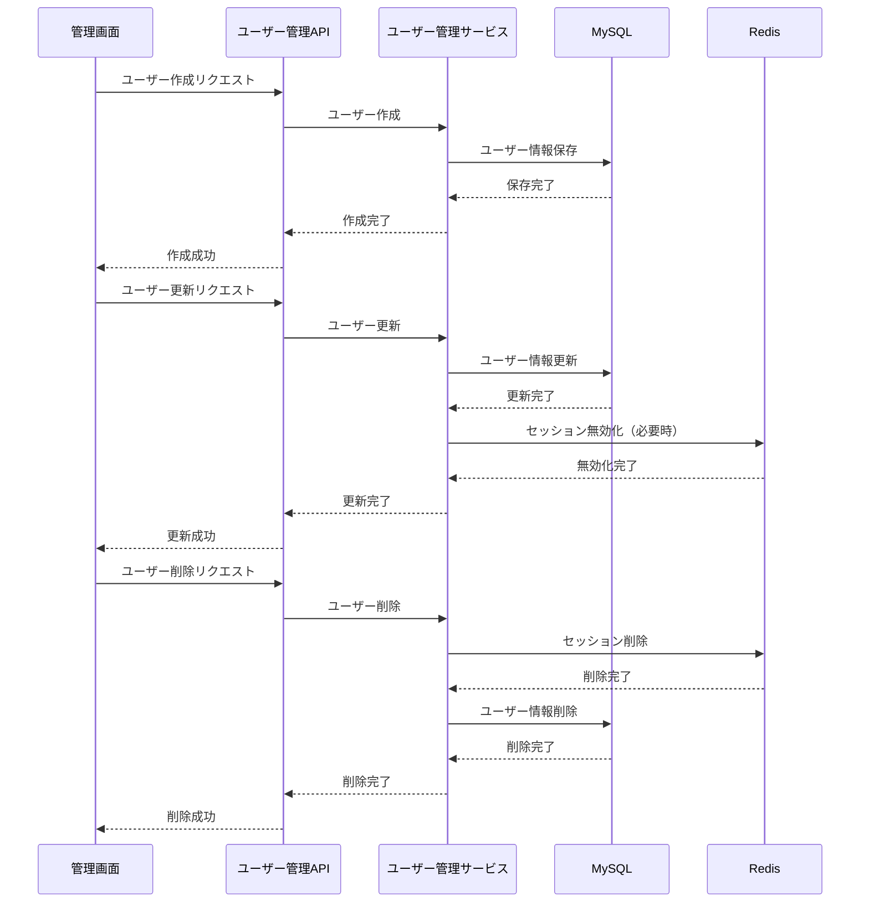
```mermaid
sequenceDiagram
    participant UI as 管理画面
    participant UserAPI as ユーザー管理API
    participant UserService as ユーザー管理サービス
    participant DB as MySQL
    participant Redis as Redis

    UI->>UserAPI: ユーザー作成リクエスト
    UserAPI->>UserService: ユーザー作成
    UserService->>DB: ユーザー情報保存
    DB-->>UserService: 保存完了
    UserService-->>UserAPI: 作成完了
    UserAPI-->>UI: 作成成功

    UI->>UserAPI: ユーザー更新リクエスト
    UserAPI->>UserService: ユーザー更新
    UserService->>DB: ユーザー情報更新
    DB-->>UserService: 更新完了
    UserService->>Redis: セッション無効化（必要時）
    Redis-->>UserService: 無効化完了
    UserService-->>UserAPI: 更新完了
    UserAPI-->>UI: 更新成功

    UI->>UserAPI: ユーザー削除リクエスト
    UserAPI->>UserService: ユーザー削除
    UserService->>Redis: セッション削除
    Redis-->>UserService: 削除完了
    UserService->>DB: ユーザー情報削除
    DB-->>UserService: 削除完了
    UserService-->>UserAPI: 削除完了
    UserAPI-->>UI: 削除成功
```

#### 3.1.3.4 通信プロトコル定義

本システムで使用する通信プロトコル、ポート番号、認証方式を以下に定義します。

##### 通信プロトコル一覧表

| 通信元 | 通信先 | プロトコル | ポート番号 | 認証方式 | 備考 |
|--------|--------|-----------|-----------|---------|------|
| ユーザー（ブラウザ） | 管理画面 | HTTPS | 443 | なし | 外部アクセス |
| 管理画面 | 設定管理API | HTTPS | 443 | セッションクッキー | REST API、JSON形式 |
| 管理画面 | ユーザー管理API | HTTPS | 443 | セッションクッキー | REST API、JSON形式 |
| 管理画面 | ログ取得API | HTTPS | 443 | セッションクッキー | REST API、JSON形式 |
| 設定管理API | 設定管理サービス | HTTP | 8080 | なし（内部通信） | 同一ネットワーク内、認証不要 ※本番環境ではmTLS必須 |
| ユーザー管理API | ユーザー管理サービス | HTTP | 8081 | なし（内部通信） | 同一ネットワーク内、認証不要 ※本番環境ではmTLS必須 |
| ログ取得API | ログ管理サービス | HTTP | 8082 | なし（内部通信） | 同一ネットワーク内、認証不要 ※本番環境ではmTLS必須 |
| 設定管理サービス | MySQL | MySQL Protocol | 3306 | ユーザー名/パスワード | 接続プール経由 |
| ユーザー管理サービス | MySQL | MySQL Protocol | 3306 | ユーザー名/パスワード | 接続プール経由 |
| シグニチャ収集サービス | MySQL | MySQL Protocol | 3306 | ユーザー名/パスワード | 接続プール経由 |
| 設定管理サービス | Redis | Redis Protocol | 6379 | パスワード（オプション） | キャッシュ、セッション |
| ユーザー管理サービス | Redis | Redis Protocol | 6379 | パスワード（オプション） | セッション管理 |
| ログ管理サービス | ログ分析エンジン | HTTP | 8083 | なし（内部通信） | 同一ネットワーク内、認証不要 ※本番環境ではmTLS必須 |
| WAFエンジン（ConfigAgent） | 設定管理API | HTTPS | 443 | APIトークン | 設定取得（ポーリング/Webhook） |
| WAFエンジン（LogAgent） | ログ収集サービス | TCP | 24224 | なし（内部通信）※本番環境ではTLS暗号化と共有キー認証を推奨 | Fluentd Forward Protocol |
| WAFエンジン（RateLimit） | Redis | Redis Protocol | 6379 | パスワード（オプション） | レート制限カウンター |
| ログ分析エンジン | ログ転送サービス | HTTP | 8084 | なし（内部通信） | 同一ネットワーク内、認証不要 ※本番環境ではmTLS必須 |
| ログ転送サービス | 外部ストレージ（S3等） | HTTPS | 443 | AWS認証情報等 | ログアーカイブ |

##### プロトコル詳細

###### HTTPS（TLS 1.2以上）

- **用途**: 外部アクセス、管理画面とAPI間の通信、WAFエンジンと管理API間の通信
- **ポート**: 443（標準）
- **認証**: 
  - 管理画面 ↔ API: セッションクッキー（ログイン後に発行）
  - WAFエンジン ↔ API: APIトークン（Authorizationヘッダー）
- **暗号化**: TLS 1.2以上を必須とする
- **証明書**: 有効なSSL/TLS証明書を使用（Let's Encrypt等）

###### HTTP（内部通信）

- **用途**: 同一ネットワーク内のサービス間通信
- **ポート**: 
  - API ↔ サービス: 8080-8082
  - ログ管理サービス ↔ ログ分析エンジン: 8083
  - ログ分析エンジン ↔ ログ転送サービス: 8084
- **認証**: なし（内部通信のため） ※セキュリティ強化のため、mTLS（mutual TLS）等の導入を強く推奨
- **セキュリティ**: ネットワークポリシー（Kubernetes NetworkPolicy等）でアクセス制御。Defense in Depth（多層防御）の原則に基づき、内部通信にも認証を導入することで、万が一ネットワーク内部に侵入された場合でも不正なサービス間通信を防ぐことができます。

###### MySQL Protocol

- **用途**: リレーショナルデータベースへの接続
- **ポート**: 3306（標準）
- **認証**: ユーザー名/パスワード
- **接続方式**: 接続プール経由（HikariCP等）
- **文字コード**: utf8mb4
- **SSL/TLS**: 内部通信のためオプション（本番環境では推奨）

###### Redis Protocol

- **用途**: キャッシュ、セッション管理、レート制限カウンター
- **ポート**: 6379（標準）
- **認証**: パスワード認証（オプション、本番環境では推奨）
- **接続方式**: 直接接続（接続プール使用可能）

###### Fluentd Forward Protocol

- **用途**: WAFエンジンからログ管理サーバへのログ転送
- **ポート**: 24224（標準）
- **認証**: なし（内部ネットワーク内での通信） ※本番環境ではTLS暗号化と共有キー認証の利用を強く推奨
- **プロトコル**: TCP（Fluentd Forward ProtocolはTCP上で動作する独自のバイナリプロトコル）
- **セキュリティ**: ネットワークポリシーでアクセス制御。本番環境ではTLS暗号化と共有キー認証の利用を推奨

##### 認証方式の詳細

###### セッションクッキー認証（管理画面 ↔ API）

1. ユーザーが管理画面でログイン
2. ユーザー管理サービスが認証を実行
3. 認証成功後、セッションIDをRedisに保存
4. セッションIDをクッキーとしてブラウザに返却
5. 以降のリクエストでクッキーを送信して認証

**セッション管理**:
- セッション有効期限: 30分（無操作時）
- セッションストレージ: Redis
- セッション無効化: ログアウト時、管理者による強制無効化時

###### APIトークン認証（WAFエンジン ↔ 管理API）

1. WAFエンジンにAPIトークンを設定（環境変数または設定ファイル）
2. 設定取得リクエスト時に`Authorization: Bearer <token>`ヘッダーを送信
3. 管理APIがトークンを検証
4. 検証成功後、設定データを返却

**トークン管理**:
- トークン生成: 管理画面から生成・発行
- トークン有効期限: 90日（定期的なローテーションを推奨）
- トークン権限: 設定取得のみ（読み取り専用）
- トークンローテーション: 有効期限が近づいたら再発行を推奨

##### ポート番号の割り当て

| ポート番号 | 用途 | プロトコル |
|----------|------|-----------|
| 443 | HTTPS（外部アクセス、API） | HTTPS |
| 3306 | MySQL | MySQL Protocol |
| 6379 | Redis | Redis Protocol |
| 8080 | 設定管理サービス（内部） | HTTP |
| 8081 | ユーザー管理サービス（内部） | HTTP |
| 8082 | ログ管理サービス（内部） | HTTP |
| 8083 | ログ分析エンジン（内部） | HTTP |
| 8084 | ログ転送サービス（内部） | HTTP |
| 24224 | Fluentd Forward（ログ転送） | TCP |

#### 3.1.3.6 コンポーネント間の関係性

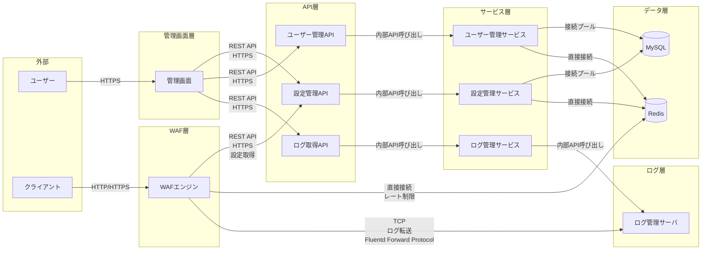
```mermaid
graph LR
    subgraph "外部"
        User[ユーザー]
        Client[クライアント]
    end

    subgraph "管理画面層"
        AdminUI[管理画面]
    end

    subgraph "API層"
        ConfigAPI[設定管理API]
        UserAPI[ユーザー管理API]
        LogAPI[ログ取得API]
    end

    subgraph "サービス層"
        ConfigService[設定管理サービス]
        UserService[ユーザー管理サービス]
        LogService[ログ管理サービス]
    end

    subgraph "データ層"
        MySQL[(MySQL)]
        Redis[(Redis)]
    end

    subgraph "WAF層"
        WAFEngine[WAFエンジン]
    end

    subgraph "ログ層"
        LogServer[ログ管理サーバ]
    end

    User -->|HTTPS| AdminUI
    Client -->|HTTP/HTTPS| WAFEngine

    AdminUI -->|REST API<br/>HTTPS| ConfigAPI
    AdminUI -->|REST API<br/>HTTPS| UserAPI
    AdminUI -->|REST API<br/>HTTPS| LogAPI

    ConfigAPI -->|内部API呼び出し| ConfigService
    UserAPI -->|内部API呼び出し| UserService
    LogAPI -->|内部API呼び出し| LogService

    ConfigService -->|接続プール| MySQL
    ConfigService -->|直接接続| Redis
    UserService -->|接続プール| MySQL
    UserService -->|直接接続| Redis
    LogService -->|内部API呼び出し| LogServer

    WAFEngine -->|REST API<br/>HTTPS<br/>設定取得| ConfigAPI
    WAFEngine -->|直接接続<br/>レート制限| Redis
    WAFEngine -->|TCP<br/>ログ転送<br/>Fluentd Forward Protocol| LogServer
```

**関係性の詳細:**

1. **管理画面 ↔ 管理API**: REST API（HTTPS）
   - セッションクッキーによる認証
   - JSON形式でのデータ交換

2. **管理API ↔ バックエンドサービス**: 内部API呼び出し
   - 同一ネットワーク内での通信
   - 認証不要（内部通信）
   - **セキュリティ**: ネットワークポリシー（例: KubernetesのNetworkPolicy）によって意図しないアクセスがブロックされることが前提

3. **バックエンドサービス ↔ ログ管理サーバ**: 内部API呼び出し
   - ログ管理サービスがログ管理サーバと連携
   - 同一ネットワーク内での通信
   - 認証不要（内部通信）
   - **セキュリティ**: ネットワークポリシー（例: KubernetesのNetworkPolicy）によって意図しないアクセスがブロックされることが前提

4. **バックエンドサービス ↔ データストア**: 
   - **MySQL**: 接続プール経由で接続
   - **Redis**: 直接接続（セッション、キャッシュ、レート制限）

5. **WAFエンジン ↔ 管理API**: REST API（設定取得、HTTPS）
   - APIトークンによる認証
   - ポーリングまたはWebhookで設定を取得

6. **WAFエンジン ↔ ログ管理サーバ**: TCP（ログ転送）
   - Fluentd Forward Protocol（TCP上で動作する独自のバイナリプロトコル）
   - 内部ネットワーク内での通信（認証なし）※本番環境ではTLS暗号化と共有キー認証の利用を強く推奨
   - **セキュリティ**: ネットワークポリシー（例: KubernetesのNetworkPolicy）によって意図しないアクセスがブロックされることが前提。本番環境ではTLS暗号化と共有キー認証の利用を推奨

7. **WAFエンジン ↔ Redis**: 直接接続（レート制限）
   - Redis Protocolで直接接続
   - レート制限カウンターの管理

##### 設定配信フロー

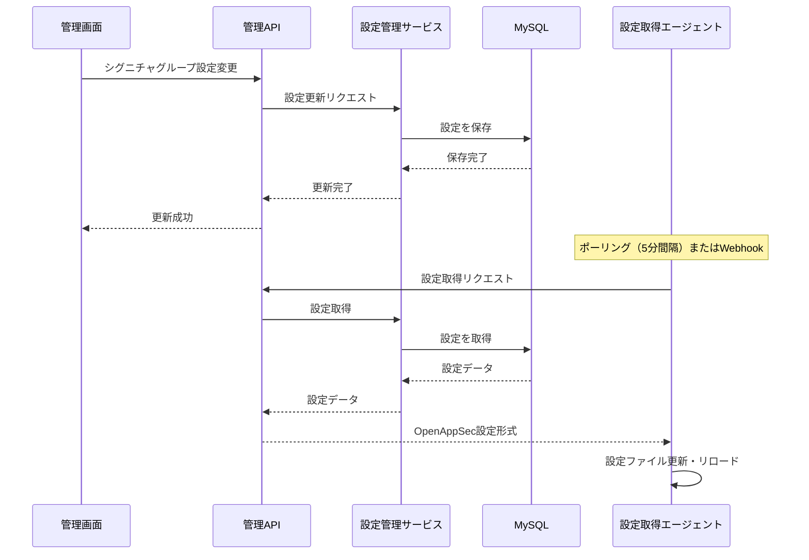
```mermaid
sequenceDiagram
    participant UI as 管理画面
    participant API as 管理API
    participant Service as 設定管理サービス
    participant DB as MySQL
    participant ConfigAgent as 設定取得エージェント

    UI->>API: シグニチャグループ設定変更
    API->>Service: 設定更新リクエスト
    Service->>DB: 設定を保存
    DB-->>Service: 保存完了
    Service-->>API: 更新完了
    API-->>UI: 更新成功

    Note over ConfigAgent: ポーリング（5分間隔）またはWebhook
    ConfigAgent->>API: 設定取得リクエスト
    API->>Service: 設定取得
    Service->>DB: 設定を取得
    DB-->>Service: 設定データ
    Service-->>API: 設定データ
    API-->>ConfigAgent: OpenAppSec設定形式
    ConfigAgent->>ConfigAgent: 設定ファイル更新・リロード
```

##### ログ転送フロー

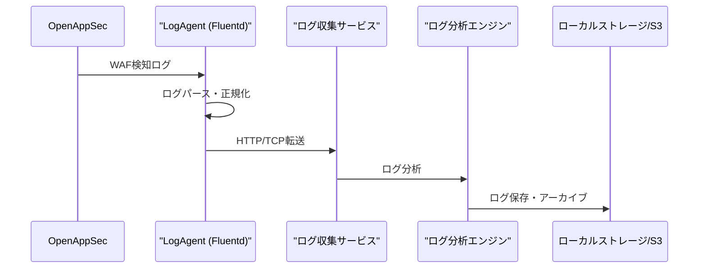
```mermaid
sequenceDiagram
    participant OpenAppSec as OpenAppSec
    participant LogAgent as "LogAgent (Fluentd)"
    participant LogCollector as "ログ収集サービス"
    participant LogAnalyzer as "ログ分析エンジン"
    participant Storage as ローカルストレージ/S3

    OpenAppSec->>LogAgent: WAF検知ログ
    LogAgent->>LogAgent: ログパース・正規化
    LogAgent->>LogCollector: HTTP/TCP転送
    LogCollector->>LogAnalyzer: ログ分析
    LogAnalyzer->>Storage: ログ保存・アーカイブ
```

##### ログ取得フロー


```mermaid
sequenceDiagram
    participant UI as 管理画面
    participant LogAPI as ログ取得API
    participant LogService as ログ管理サービス
    participant LogAnalyzer as ログ分析エンジン
    participant Storage as ローカルストレージ/S3

    UI->>LogAPI: ログ検索リクエスト
    LogAPI->>LogService: ログ検索リクエスト
    LogService->>LogAnalyzer: ログ検索
    LogAnalyzer->>Storage: ログデータ取得
    Storage-->>LogAnalyzer: ログデータ
    LogAnalyzer-->>LogService: 検索結果
    LogService-->>LogAPI: 検索結果
    LogAPI-->>UI: ログ一覧

    UI->>LogAPI: ログダウンロードリクエスト
    LogAPI->>LogService: ログダウンロードリクエスト
    LogService->>LogAnalyzer: ログデータ取得
    LogAnalyzer->>Storage: ログデータ取得
    Storage-->>LogAnalyzer: ログデータ
    LogAnalyzer-->>LogService: ログデータ
    LogService-->>LogAPI: ログデータ
    LogAPI-->>UI: ログダウンロード
```

##### 認証フロー

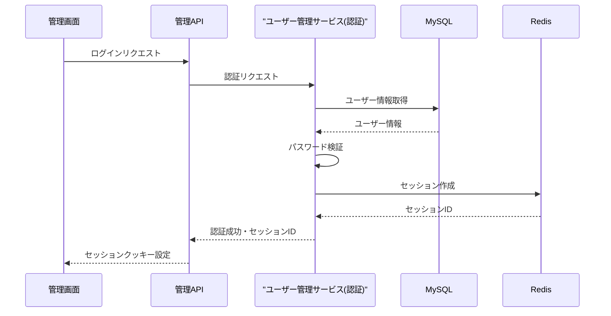
```mermaid
sequenceDiagram
    participant UI as 管理画面
    participant API as 管理API
    participant UserService as "ユーザー管理サービス(認証)"
    participant DB as MySQL
    participant Redis as Redis

    UI->>API: ログインリクエスト
    API->>UserService: 認証リクエスト
    UserService->>DB: ユーザー情報取得
    DB-->>UserService: ユーザー情報
    UserService->>UserService: パスワード検証
    UserService->>Redis: セッション作成
    Redis-->>UserService: セッションID
    UserService-->>API: 認証成功・セッションID
    API-->>UI: セッションクッキー設定
```

#### 3.1.3.5 セキュリティ境界

本システムのセキュリティ境界を明確に定義し、各境界でのセキュリティ要件を以下に示します。

##### セキュリティ境界の定義

セキュリティ境界は、システムを保護するための多層防御（Defense in Depth）の観点から、以下の3つの境界に分類されます：

1. **外部境界（External Boundary）**: インターネットとシステム内部の境界
2. **内部境界（Internal Boundary）**: システム内部のコンポーネント間の境界
3. **データ境界（Data Boundary）**: データストアへのアクセス境界

##### セキュリティ境界図

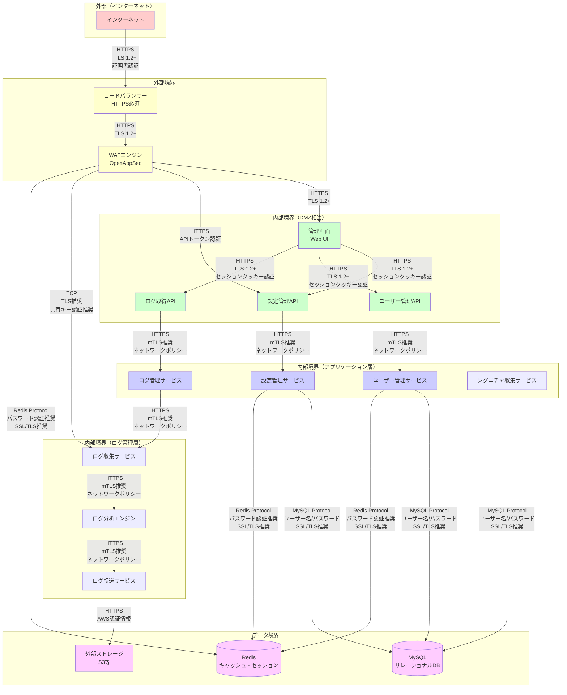
```mermaid
graph TB
    subgraph "外部（インターネット）"
        Internet[インターネット]
    end

    subgraph "外部境界"
        LoadBalancer[ロードバランサー<br/>HTTPS必須]
        WAF[WAFエンジン<br/>OpenAppSec]
    end

    subgraph "内部境界（DMZ相当）"
        AdminUI[管理画面<br/>Web UI]
        ConfigAPI[設定管理API]
        UserAPI[ユーザー管理API]
        LogAPI[ログ取得API]
    end

    subgraph "内部境界（アプリケーション層）"
        ConfigService[設定管理サービス]
        UserService[ユーザー管理サービス]
        LogService[ログ管理サービス]
        SignatureService[シグニチャ収集サービス]
    end

    subgraph "内部境界（ログ管理層）"
        LogCollector[ログ収集サービス]
        LogAnalyzer[ログ分析エンジン]
        LogForwarder[ログ転送サービス]
    end

    subgraph "データ境界"
        MySQL[(MySQL<br/>リレーショナルDB)]
        Redis[(Redis<br/>キャッシュ・セッション)]
        ExternalStorage[外部ストレージ<br/>S3等]
    end

    Internet -->|HTTPS<br/>TLS 1.2+<br/>証明書認証| LoadBalancer
    LoadBalancer -->|HTTPS<br/>TLS 1.2+| WAF
    WAF -->|HTTPS<br/>TLS 1.2+| AdminUI

    AdminUI -->|HTTPS<br/>TLS 1.2+<br/>セッションクッキー認証| ConfigAPI
    AdminUI -->|HTTPS<br/>TLS 1.2+<br/>セッションクッキー認証| UserAPI
    AdminUI -->|HTTPS<br/>TLS 1.2+<br/>セッションクッキー認証| LogAPI

    ConfigAPI -->|HTTPS<br/>mTLS推奨<br/>ネットワークポリシー| ConfigService
    UserAPI -->|HTTPS<br/>mTLS推奨<br/>ネットワークポリシー| UserService
    LogAPI -->|HTTPS<br/>mTLS推奨<br/>ネットワークポリシー| LogService

    ConfigService -->|MySQL Protocol<br/>ユーザー名/パスワード<br/>SSL/TLS推奨| MySQL
    UserService -->|MySQL Protocol<br/>ユーザー名/パスワード<br/>SSL/TLS推奨| MySQL
    SignatureService -->|MySQL Protocol<br/>ユーザー名/パスワード<br/>SSL/TLS推奨| MySQL

    ConfigService -->|Redis Protocol<br/>パスワード認証推奨<br/>SSL/TLS推奨| Redis
    UserService -->|Redis Protocol<br/>パスワード認証推奨<br/>SSL/TLS推奨| Redis

    LogService -->|HTTPS<br/>mTLS推奨<br/>ネットワークポリシー| LogCollector
    LogCollector -->|HTTPS<br/>mTLS推奨<br/>ネットワークポリシー| LogAnalyzer
    LogAnalyzer -->|HTTPS<br/>mTLS推奨<br/>ネットワークポリシー| LogForwarder
    LogForwarder -->|HTTPS<br/>AWS認証情報| ExternalStorage

    WAF -->|HTTPS<br/>APIトークン認証| ConfigAPI
    WAF -->|TCP<br/>TLS推奨<br/>共有キー認証推奨| LogCollector
    WAF -->|Redis Protocol<br/>パスワード認証推奨<br/>SSL/TLS推奨| Redis

    style Internet fill:#ffcccc
    style LoadBalancer fill:#ffffcc
    style WAF fill:#ffffcc
    style AdminUI fill:#ccffcc
    style ConfigAPI fill:#ccffcc
    style UserAPI fill:#ccffcc
    style LogAPI fill:#ccffcc
    style ConfigService fill:#ccccff
    style UserService fill:#ccccff
    style LogService fill:#ccccff
    style MySQL fill:#ffccff
    style Redis fill:#ffccff
    style ExternalStorage fill:#ffccff
```

**凡例**:
- 🔴 **赤色**: 外部（インターネット）
- 🟡 **黄色**: 外部境界（DMZ相当）
- 🟢 **緑色**: 内部境界（DMZ相当: 管理画面・API層）
- 🔵 **青色**: 内部境界（アプリケーション層・ログ管理層）
- 🟣 **紫色**: データ境界

##### 外部境界（External Boundary）

**定義**: インターネットとシステム内部の境界。外部からのアクセスを制御する最初の防御層。

**対象コンポーネント**:
- ロードバランサー
- WAFエンジン（OpenAppSec）
- 管理画面（Web UI）

**セキュリティ要件**:

1. **通信の暗号化**
   - **必須**: HTTPS（TLS 1.2以上）を使用
   - **証明書**: 有効なSSL/TLS証明書を使用（Let's Encrypt等）
   - **証明書の検証**: クライアント側で証明書の検証を必須とする

2. **アクセス制御**
   - **WAFエンジン**: すべてのHTTP/HTTPSリクエストを検査し、攻撃を検知・防御
   - **レート制限**: DDoS攻撃対策としてレート制限を実装
   - **IP AllowList**: 管理画面へのアクセスを特定のIPアドレスに制限（オプション）

3. **認証・認可**
   - **管理画面**: セッションクッキーによる認証（ログイン必須）
   - **API**: セッションクッキーまたはAPIトークンによる認証
   - **WAFエンジン**: APIトークンによる認証（設定取得時）

4. **ログ・監視**
   - すべての外部アクセスをログに記録
   - 異常なアクセスパターンを検知・アラート

##### 内部境界（Internal Boundary）

**定義**: システム内部のコンポーネント間の境界。内部ネットワーク内での通信を制御する防御層。

**対象コンポーネント**:
- **管理API ↔ バックエンドサービス**:
  - 設定管理API ↔ 設定管理サービス
  - ユーザー管理API ↔ ユーザー管理サービス
  - ログ取得API ↔ ログ管理サービス
- **バックエンドサービス ↔ ログ管理サーバ**:
  - ログ管理サービス ↔ ログ収集サービス
  - ログ収集サービス ↔ ログ分析エンジン
  - ログ分析エンジン ↔ ログ転送サービス
- **WAFエンジン ↔ ログ管理サーバ**:
  - WAFエンジン（LogAgent） ↔ ログ収集サービス

**セキュリティ要件**:

1. **ネットワーク分離**
   - **必須**: 同一ネットワーク内での通信（VPC、Kubernetesクラスタ内等）
   - **ネットワークポリシー**: Kubernetes NetworkPolicy等でアクセス制御
   - **セグメンテーション**: 必要に応じてネットワークセグメントを分離

2. **通信の暗号化**
   - **推奨**: mTLS（mutual TLS）による相互認証
   - **本番環境**: mTLSを必須とする
   - **開発環境**: ネットワークポリシーによる保護を前提とする

3. **認証・認可**
   - **本番環境**: mTLSまたはJWTトークンによるサービス間認証を必須とする
   - **開発環境**: ネットワークポリシーによる保護を前提とする
   - **サービス間通信**: サービスメッシュ（Istio等）の導入を検討

4. **アクセス制御**
   - **最小権限の原則**: 各サービスは必要最小限の権限のみを持つ
   - **ネットワークポリシー**: 許可されたコンポーネント間のみ通信を許可
   - **ファイアウォール**: 必要に応じて内部ファイアウォールを設定

##### データ境界（Data Boundary）

**定義**: データストアへのアクセス境界。機密データを保護する最後の防御層。

**対象コンポーネント**:
- MySQL（リレーショナルデータベース）
- Redis（キャッシュ・セッションストア）
- 外部ストレージ（S3等）

**セキュリティ要件**:

1. **アクセス制御**
   - **必須**: ユーザー名/パスワードによる認証
   - **最小権限の原則**: 各サービスは必要最小限のデータベース権限のみを持つ
   - **接続プール**: 接続プール経由でアクセス（HikariCP等）

2. **通信の暗号化**
   - **推奨**: SSL/TLSによる通信の暗号化（本番環境では必須）
   - **MySQL**: SSL/TLS接続を推奨（本番環境では必須）
   - **Redis**: SSL/TLSによる通信の暗号化を推奨（本番環境では必須）、パスワード認証も推奨（本番環境では必須）

3. **データ保護**
   - **暗号化**: 機密データ（パスワード、APIトークン等）は暗号化して保存
   - **バックアップ**: バックアップデータも暗号化して保存
   - **アクセスログ**: すべてのデータアクセスをログに記録

4. **ネットワーク分離**
   - **必須**: データベースは内部ネットワーク内でのみアクセス可能
   - **外部アクセス**: 外部からの直接アクセスは禁止
   - **管理アクセス**: 管理用アクセスはVPN経由等で制限

##### セキュリティ境界間の通信要件

| 境界間 | 通信方式 | 認証方式 | 暗号化 | 備考 |
|--------|---------|---------|--------|------|
| 外部 → 外部境界 | HTTPS | 証明書認証 | TLS 1.2+ | 必須 |
| 外部境界 → 内部境界 | HTTPS | セッションクッキー/APIトークン | TLS 1.2+ | 必須 |
| 内部境界 → 内部境界 | HTTPS | mTLS推奨 | TLS 1.2+ (mTLS推奨) | 本番環境ではmTLS必須 |
| 内部境界 → データ境界 | MySQL/Redis Protocol | ユーザー名/パスワード | SSL/TLS推奨 | 本番環境ではSSL/TLS必須 |
| データ境界 → 外部ストレージ | HTTPS | AWS認証情報等 | TLS 1.2+ | 必須 |

##### セキュリティ対策の実装方針

1. **多層防御（Defense in Depth）**
   - 単一のセキュリティ対策に依存せず、複数の防御層を実装
   - 各境界で独立したセキュリティ対策を実装

2. **最小権限の原則（Principle of Least Privilege）**
   - 各コンポーネントは必要最小限の権限のみを持つ
   - データベースアクセス権限を最小限に制限

3. **監視・ログ**
   - すべての境界を越える通信をログに記録
   - 異常なアクセスパターンを検知・アラート

4. **定期的なセキュリティ監査**
   - セキュリティ境界の設定を定期的に監査
   - 脆弱性スキャンを定期的に実施

### 3.1.4 マイクロサービス/モノリスの選択

#### 3.1.4.1 選択: モノリシックアーキテクチャ（初版）

**理由**:
- 開発・運用の複雑さを最小化
- 小規模チームでの開発効率を重視
- 将来のマイクロサービス化を考慮した設計

#### 3.1.4.2 将来のマイクロサービス化への備え

- **APIファースト設計**: 各機能をAPIとして設計
- **疎結合設計**: サービス間の依存を最小化
- **データベース分離の準備**: テーブル単位で分離可能な設計

### 3.1.5 サービス間通信設計

#### 3.1.5.1 REST API

- **プロトコル**: HTTP/HTTPS
- **データ形式**: JSON
- **認証**: セッションクッキー（管理画面）、APIトークン（WAFエンジン）
- **エラーハンドリング**: HTTPステータスコード + JSONエラーレスポンス

#### 3.1.5.2 内部通信

- **同期通信**: REST API（設定取得等）
- **非同期通信**: 将来拡張用（メッセージキュー等）

### 3.1.6 実装方針

1. **コンポーネント分離**: 各コンポーネントは独立してデプロイ可能
2. **設定の外部化**: 環境変数・設定ファイルで動作を制御
3. **ログの統一**: 構造化ログ（JSON形式）を採用
4. **監視の統一**: サイドカー方式でメトリクス収集

### 3.1.7 注意事項

- WAFエンジンは水平スケーリング可能な設計
- ログ管理サーバは将来のクラウド連携を考慮
- データベースはレプリケーション非対応（初版）

---

## 3.2 データベース設計

### 3.2.1 概要

MySQL 8.4系を使用し、utf8mb4文字コードで実装します。Flywayを使用してマイグレーションを管理します。

### 3.2.2 設計方針

- **正規化**: 第3正規形まで正規化
- **インデックス**: 検索・結合で使用されるカラムにインデックスを設定
- **外部キー制約**: データ整合性を保つため外部キー制約を設定
- **タイムスタンプ**: created_at, updated_atを全テーブルに設定

### 3.2.3 ER図（主要エンティティ）

#### 3.2.3.1 ユーザー関連

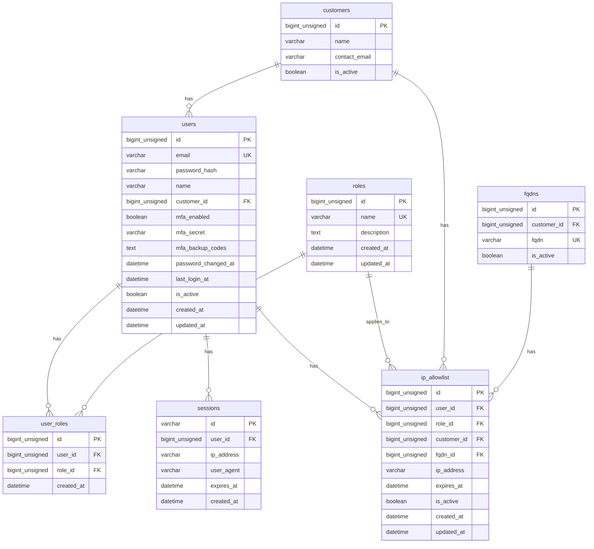
```mermaid
erDiagram
    users ||--o{ user_roles : "has"
    roles ||--o{ user_roles : "assigned_to"
    users ||--o{ sessions : "has"
    users ||--o{ ip_allowlist : "has"
    customers ||--o{ users : "has"
    roles ||--o{ ip_allowlist : "applies_to"
    customers ||--o{ ip_allowlist : "has"
    fqdns ||--o{ ip_allowlist : "has"
    
    users {
        bigint_unsigned id PK
        varchar email UK
        varchar password_hash
        varchar name
        bigint_unsigned customer_id FK
        boolean mfa_enabled
        varchar mfa_secret
        text mfa_backup_codes
        datetime password_changed_at
        datetime last_login_at
        boolean is_active
        datetime created_at
        datetime updated_at
    }
    
    roles {
        bigint_unsigned id PK
        varchar name UK
        text description
        datetime created_at
        datetime updated_at
    }
    
    user_roles {
        bigint_unsigned id PK
        bigint_unsigned user_id FK
        bigint_unsigned role_id FK
        datetime created_at
    }
    
    sessions {
        varchar id PK
        bigint_unsigned user_id FK
        varchar ip_address
        varchar user_agent
        datetime expires_at
        datetime created_at
    }
    
    ip_allowlist {
        bigint_unsigned id PK
        bigint_unsigned user_id FK
        bigint_unsigned role_id FK
        bigint_unsigned customer_id FK
        bigint_unsigned fqdn_id FK
        varchar ip_address
        datetime expires_at
        boolean is_active
        datetime created_at
        datetime updated_at
    }
    
    customers {
        bigint_unsigned id PK
        varchar name
        varchar contact_email
        boolean is_active
    }
    
    fqdns {
        bigint_unsigned id PK
        bigint_unsigned customer_id FK
        varchar fqdn UK
        boolean is_active
    }
```

#### 3.2.3.2 顧客・FQDN関連

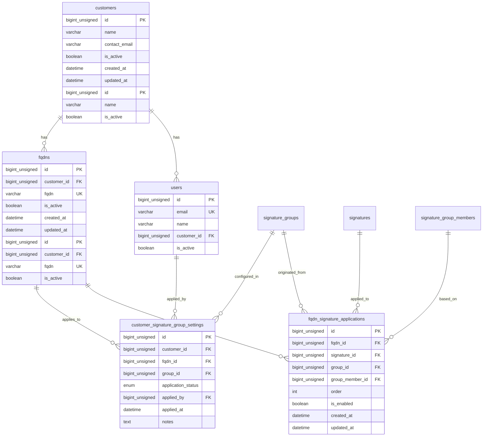
```mermaid
erDiagram
    customers ||--o{ fqdns : "has"
    customers ||--o{ users : "has"
    fqdns ||--o{ customer_signature_group_settings : "applies_to"
    signature_groups ||--o{ customer_signature_group_settings : "configured_in"
    users ||--o{ customer_signature_group_settings : "applied_by"
    fqdns ||--o{ fqdn_signature_applications : "has"
    signatures ||--o{ fqdn_signature_applications : "applied_to"
    signature_groups ||--o{ fqdn_signature_applications : "originated_from"
    signature_group_members ||--o{ fqdn_signature_applications : "based_on"
    
    customers {
        bigint_unsigned id PK
        varchar name
        varchar contact_email
        boolean is_active
        datetime created_at
        datetime updated_at
    }
    
    fqdns {
        bigint_unsigned id PK
        bigint_unsigned customer_id FK
        varchar fqdn UK
        boolean is_active
        datetime created_at
        datetime updated_at
    }
    
    customer_signature_group_settings {
        bigint_unsigned id PK
        bigint_unsigned customer_id FK
        bigint_unsigned fqdn_id FK
        bigint_unsigned group_id FK
        enum application_status
        bigint_unsigned applied_by FK
        datetime applied_at
        text notes
    }
    
    fqdn_signature_applications {
        bigint_unsigned id PK
        bigint_unsigned fqdn_id FK
        bigint_unsigned signature_id FK
        bigint_unsigned group_id FK
        bigint_unsigned group_member_id FK
        int order
        boolean is_enabled
        datetime created_at
        datetime updated_at
    }
    
    customers {
        bigint_unsigned id PK
        varchar name
        boolean is_active
    }
    
    fqdns {
        bigint_unsigned id PK
        bigint_unsigned customer_id FK
        varchar fqdn UK
        boolean is_active
    }
    
    users {
        bigint_unsigned id PK
        varchar email UK
        varchar name
        bigint_unsigned customer_id FK
        boolean is_active
    }
```

#### 3.2.3.3 シグニチャ関連

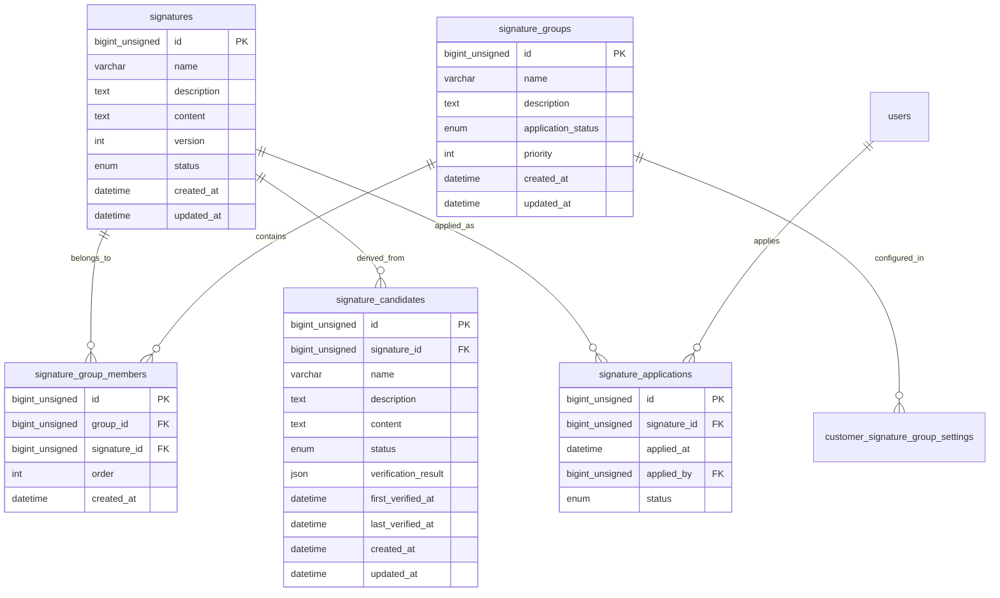
```mermaid
erDiagram
    signatures ||--o{ signature_group_members : "belongs_to"
    signature_groups ||--o{ signature_group_members : "contains"
    signatures ||--o{ signature_candidates : "derived_from"
    signatures ||--o{ signature_applications : "applied_as"
    users ||--o{ signature_applications : "applies"
    signature_groups ||--o{ customer_signature_group_settings : "configured_in"
    
    signatures {
        bigint_unsigned id PK
        varchar name
        text description
        text content
        int version
        enum status
        datetime created_at
        datetime updated_at
    }
    
    signature_groups {
        bigint_unsigned id PK
        varchar name
        text description
        enum application_status
        int priority
        datetime created_at
        datetime updated_at
    }
    
    signature_group_members {
        bigint_unsigned id PK
        bigint_unsigned group_id FK
        bigint_unsigned signature_id FK
        int order
        datetime created_at
    }
    
    signature_candidates {
        bigint_unsigned id PK
        bigint_unsigned signature_id FK
        varchar name
        text description
        text content
        enum status
        json verification_result
        datetime first_verified_at
        datetime last_verified_at
        datetime created_at
        datetime updated_at
    }
    
    signature_applications {
        bigint_unsigned id PK
        bigint_unsigned signature_id FK
        datetime applied_at
        bigint_unsigned applied_by FK
        enum status
    }
```

#### 3.2.3.4 通知関連

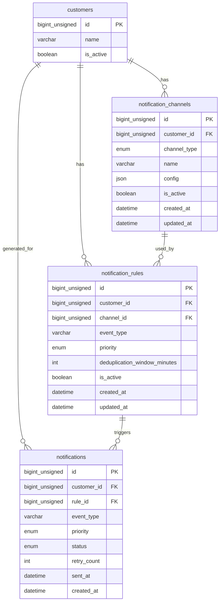
```mermaid
erDiagram
    customers ||--o{ notification_channels : "has"
    customers ||--o{ notification_rules : "has"
    customers ||--o{ notifications : "generated_for"
    notification_channels ||--o{ notification_rules : "used_by"
    notification_rules ||--o{ notifications : "triggers"
    
    notification_channels {
        bigint_unsigned id PK
        bigint_unsigned customer_id FK
        enum channel_type
        varchar name
        json config
        boolean is_active
        datetime created_at
        datetime updated_at
    }
    
    notification_rules {
        bigint_unsigned id PK
        bigint_unsigned customer_id FK
        bigint_unsigned channel_id FK
        varchar event_type
        enum priority
        int deduplication_window_minutes
        boolean is_active
        datetime created_at
        datetime updated_at
    }
    
    notifications {
        bigint_unsigned id PK
        bigint_unsigned customer_id FK
        bigint_unsigned rule_id FK
        varchar event_type
        enum priority
        enum status
        int retry_count
        datetime sent_at
        datetime created_at
    }
    
    customers {
        bigint_unsigned id PK
        varchar name
        boolean is_active
    }
```

#### 3.2.3.5 設定関連

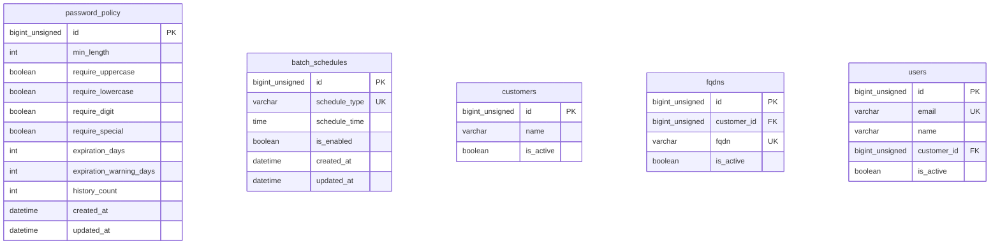
```mermaid
erDiagram
    password_policy {
        bigint_unsigned id PK
        int min_length
        boolean require_uppercase
        boolean require_lowercase
        boolean require_digit
        boolean require_special
        int expiration_days
        int expiration_warning_days
        int history_count
        datetime created_at
        datetime updated_at
    }
    
    batch_schedules {
        bigint_unsigned id PK
        varchar schedule_type UK
        time schedule_time
        boolean is_enabled
        datetime created_at
        datetime updated_at
    }
    
    customers {
        bigint_unsigned id PK
        varchar name
        boolean is_active
    }
    
    fqdns {
        bigint_unsigned id PK
        bigint_unsigned customer_id FK
        varchar fqdn UK
        boolean is_active
    }
    
    users {
        bigint_unsigned id PK
        varchar email UK
        varchar name
        bigint_unsigned customer_id FK
        boolean is_active
    }
```

#### 3.2.3.6 全体ER図

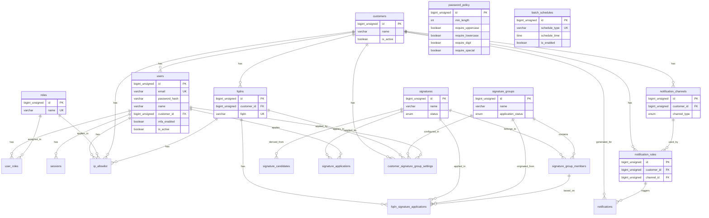
```mermaid
erDiagram
    %% ユーザー関連
    users ||--o{ user_roles : "has"
    roles ||--o{ user_roles : "assigned_to"
    users ||--o{ sessions : "has"
    users ||--o{ ip_allowlist : "has"
    roles ||--o{ ip_allowlist : "applies_to"
    
    %% 顧客・FQDN関連
    customers ||--o{ fqdns : "has"
    customers ||--o{ users : "has"
    customers ||--o{ ip_allowlist : "has"
    fqdns ||--o{ ip_allowlist : "has"
    
    %% シグニチャ関連
    signatures ||--o{ signature_group_members : "belongs_to"
    signature_groups ||--o{ signature_group_members : "contains"
    signatures ||--o{ signature_candidates : "derived_from"
    signatures ||--o{ signature_applications : "applied_as"
    users ||--o{ signature_applications : "applies"
    
    %% 顧客別シグニチャグループ設定
    customers ||--o{ customer_signature_group_settings : "has"
    fqdns ||--o{ customer_signature_group_settings : "applies_to"
    signature_groups ||--o{ customer_signature_group_settings : "configured_in"
    users ||--o{ customer_signature_group_settings : "applied_by"
    fqdns ||--o{ fqdn_signature_applications : "has"
    signatures ||--o{ fqdn_signature_applications : "applied_to"
    signature_groups ||--o{ fqdn_signature_applications : "originated_from"
    signature_group_members ||--o{ fqdn_signature_applications : "based_on"
    
    %% 通知関連
    customers ||--o{ notification_channels : "has"
    customers ||--o{ notification_rules : "has"
    customers ||--o{ notifications : "generated_for"
    notification_channels ||--o{ notification_rules : "used_by"
    notification_rules ||--o{ notifications : "triggers"
    
    %% 設定関連
    password_policy {
        bigint_unsigned id PK
        int min_length
        boolean require_uppercase
        boolean require_lowercase
        boolean require_digit
        boolean require_special
    }
    
    batch_schedules {
        bigint_unsigned id PK
        varchar schedule_type UK
        time schedule_time
        boolean is_enabled
    }
    
    users {
        bigint_unsigned id PK
        varchar email UK
        varchar password_hash
        varchar name
        bigint_unsigned customer_id FK
        boolean mfa_enabled
        boolean is_active
    }
    
    roles {
        bigint_unsigned id PK
        varchar name UK
    }
    
    customers {
        bigint_unsigned id PK
        varchar name
        boolean is_active
    }
    
    fqdns {
        bigint_unsigned id PK
        bigint_unsigned customer_id FK
        varchar fqdn UK
    }
    
    signatures {
        bigint_unsigned id PK
        varchar name
        enum status
    }
    
    signature_groups {
        bigint_unsigned id PK
        varchar name
        enum application_status
    }
    
    notification_channels {
        bigint_unsigned id PK
        bigint_unsigned customer_id FK
        enum channel_type
    }
    
    notification_rules {
        bigint_unsigned id PK
        bigint_unsigned customer_id FK
        bigint_unsigned channel_id FK
    }
```

### 3.2.4 テーブル定義書

#### 3.2.4.1 ユーザー関連テーブル

##### users（ユーザー）

| カラム名 | 型 | 制約 | 説明 |
|---------|-----|------|------|
| id | BIGINT UNSIGNED | PRIMARY KEY, AUTO_INCREMENT | ユーザーID |
| email | VARCHAR(255) | NOT NULL, UNIQUE | メールアドレス |
| password_hash | VARCHAR(255) | NOT NULL | パスワードハッシュ |
| name | VARCHAR(255) | NOT NULL | ユーザー名 |
| customer_id | BIGINT UNSIGNED | NULL, FOREIGN KEY | 顧客ID（顧客ユーザーの場合） |
| mfa_enabled | BOOLEAN | NOT NULL, DEFAULT FALSE | MFA有効フラグ |
| mfa_secret | VARCHAR(255) | NULL | MFA秘密鍵（暗号化） |
| mfa_backup_codes | TEXT | NULL | MFAバックアップコード（暗号化） |
| password_changed_at | DATETIME | NULL | パスワード変更日時 |
| last_login_at | DATETIME | NULL | 最終ログイン日時 |
| is_active | BOOLEAN | NOT NULL, DEFAULT TRUE | 有効フラグ |
| created_at | DATETIME | NOT NULL, DEFAULT CURRENT_TIMESTAMP | 作成日時 |
| updated_at | DATETIME | NOT NULL, DEFAULT CURRENT_TIMESTAMP ON UPDATE CURRENT_TIMESTAMP | 更新日時 |

**インデックス**:
- PRIMARY KEY (id)
- UNIQUE KEY (email)
- INDEX (customer_id)
- INDEX (is_active)

##### roles（ロール）

| カラム名 | 型 | 制約 | 説明 |
|---------|-----|------|------|
| id | BIGINT UNSIGNED | PRIMARY KEY, AUTO_INCREMENT | ロールID |
| name | VARCHAR(100) | NOT NULL, UNIQUE | ロール名 |
| description | TEXT | NULL | 説明 |
| created_at | DATETIME | NOT NULL, DEFAULT CURRENT_TIMESTAMP | 作成日時 |
| updated_at | DATETIME | NOT NULL, DEFAULT CURRENT_TIMESTAMP ON UPDATE CURRENT_TIMESTAMP | 更新日時 |

**ロール定義**:
- `service_admin`: サービス管理者
- `service_member`: サービス管理メンバー
- `customer_admin`: 顧客管理者
- `customer_member`: 顧客メンバー

##### user_roles（ユーザー・ロール関連）

| カラム名 | 型 | 制約 | 説明 |
|---------|-----|------|------|
| id | BIGINT UNSIGNED | PRIMARY KEY, AUTO_INCREMENT | ID |
| user_id | BIGINT UNSIGNED | NOT NULL, FOREIGN KEY | ユーザーID |
| role_id | BIGINT UNSIGNED | NOT NULL, FOREIGN KEY | ロールID |
| created_at | DATETIME | NOT NULL, DEFAULT CURRENT_TIMESTAMP | 作成日時 |

**インデックス**:
- PRIMARY KEY (id)
- UNIQUE KEY (user_id, role_id)
- INDEX (user_id)
- INDEX (role_id)

##### sessions（セッション）

| カラム名 | 型 | 制約 | 説明 |
|---------|-----|------|------|
| id | VARCHAR(255) | PRIMARY KEY | セッションID |
| user_id | BIGINT UNSIGNED | NOT NULL, FOREIGN KEY | ユーザーID |
| ip_address | VARCHAR(45) | NULL | IPアドレス |
| user_agent | VARCHAR(500) | NULL | User-Agent |
| expires_at | DATETIME | NOT NULL | 有効期限 |
| created_at | DATETIME | NOT NULL, DEFAULT CURRENT_TIMESTAMP | 作成日時 |

**インデックス**:
- PRIMARY KEY (id)
- INDEX (user_id)
- INDEX (expires_at)

#### 3.2.4.2 顧客・FQDN関連テーブル

##### customers（顧客）

| カラム名 | 型 | 制約 | 説明 |
|---------|-----|------|------|
| id | BIGINT UNSIGNED | PRIMARY KEY, AUTO_INCREMENT | 顧客ID |
| name | VARCHAR(255) | NOT NULL | 顧客名 |
| contact_email | VARCHAR(255) | NULL | 連絡先メール |
| is_active | BOOLEAN | NOT NULL, DEFAULT TRUE | 有効フラグ |
| created_at | DATETIME | NOT NULL, DEFAULT CURRENT_TIMESTAMP | 作成日時 |
| updated_at | DATETIME | NOT NULL, DEFAULT CURRENT_TIMESTAMP ON UPDATE CURRENT_TIMESTAMP | 更新日時 |

**インデックス**:
- PRIMARY KEY (id)
- INDEX (is_active)

##### fqdns（FQDN）

| カラム名 | 型 | 制約 | 説明 |
|---------|-----|------|------|
| id | BIGINT UNSIGNED | PRIMARY KEY, AUTO_INCREMENT | FQDN ID |
| customer_id | BIGINT UNSIGNED | NOT NULL, FOREIGN KEY | 顧客ID |
| fqdn | VARCHAR(255) | NOT NULL, UNIQUE | FQDN |
| is_active | BOOLEAN | NOT NULL, DEFAULT TRUE | 有効フラグ |
| created_at | DATETIME | NOT NULL, DEFAULT CURRENT_TIMESTAMP | 作成日時 |
| updated_at | DATETIME | NOT NULL, DEFAULT CURRENT_TIMESTAMP ON UPDATE CURRENT_TIMESTAMP | 更新日時 |

**インデックス**:
- PRIMARY KEY (id)
- UNIQUE KEY (fqdn)
- INDEX (customer_id)
- INDEX (is_active)

#### 3.2.4.3 シグニチャ関連テーブル

##### signatures（シグニチャ）

| カラム名 | 型 | 制約 | 説明 |
|---------|-----|------|------|
| id | BIGINT UNSIGNED | PRIMARY KEY, AUTO_INCREMENT | シグニチャID |
| name | VARCHAR(255) | NOT NULL | シグニチャ名 |
| description | TEXT | NULL | 説明 |
| content | TEXT | NOT NULL | シグニチャ内容 |
| version | INT UNSIGNED | NOT NULL, DEFAULT 1 | バージョン |
| status | ENUM('active', 'inactive', 'deprecated') | NOT NULL, DEFAULT 'active' | ステータス |
| created_at | DATETIME | NOT NULL, DEFAULT CURRENT_TIMESTAMP | 作成日時 |
| updated_at | DATETIME | NOT NULL, DEFAULT CURRENT_TIMESTAMP ON UPDATE CURRENT_TIMESTAMP | 更新日時 |

**インデックス**:
- PRIMARY KEY (id)
- INDEX (status)

##### signature_groups（シグニチャグループ）

| カラム名 | 型 | 制約 | 説明 |
|---------|-----|------|------|
| id | BIGINT UNSIGNED | PRIMARY KEY, AUTO_INCREMENT | グループID |
| name | VARCHAR(255) | NOT NULL | グループ名 |
| description | TEXT | NULL | 説明 |
| application_status | ENUM('applied', 'not_applied', 'customer_decision') | NOT NULL, DEFAULT 'customer_decision' | 適用状態 |
| priority | INT | NOT NULL, DEFAULT 0 | 優先度 |
| created_by | BIGINT UNSIGNED | NULL, FOREIGN KEY | 作成者ユーザーID |
| created_at | DATETIME | NOT NULL, DEFAULT CURRENT_TIMESTAMP | 作成日時 |
| updated_at | DATETIME | NOT NULL, DEFAULT CURRENT_TIMESTAMP ON UPDATE CURRENT_TIMESTAMP | 更新日時 |

**インデックス**:
- PRIMARY KEY (id)
- INDEX (application_status)
- INDEX (priority)

##### signature_group_members（シグニチャグループメンバー）

| カラム名 | 型 | 制約 | 説明 |
|---------|-----|------|------|
| id | BIGINT UNSIGNED | PRIMARY KEY, AUTO_INCREMENT | ID |
| group_id | BIGINT UNSIGNED | NOT NULL, FOREIGN KEY | グループID |
| signature_id | BIGINT UNSIGNED | NOT NULL, FOREIGN KEY | シグニチャID |
| order | INT | NOT NULL, DEFAULT 0 | 表示順 |
| created_at | DATETIME | NOT NULL, DEFAULT CURRENT_TIMESTAMP | 作成日時 |

**インデックス**:
- PRIMARY KEY (id)
- UNIQUE KEY (group_id, signature_id)
- INDEX (group_id)
- INDEX (signature_id)

##### signature_candidates（シグニチャ候補）

| カラム名 | 型 | 制約 | 説明 |
|---------|-----|------|------|
| id | BIGINT UNSIGNED | PRIMARY KEY, AUTO_INCREMENT | 候補ID |
| signature_id | BIGINT UNSIGNED | NULL, FOREIGN KEY | シグニチャID |
| name | VARCHAR(255) | NOT NULL | シグニチャ名 |
| description | TEXT | NULL | 説明 |
| content | TEXT | NOT NULL | シグニチャ内容 |
| status | ENUM('pending', 'approved', 'rejected', 'deleted') | NOT NULL, DEFAULT 'pending' | ステータス |
| verification_result | JSON | NULL | 検証結果 |
| first_verified_at | DATETIME | NULL | 初回検証日時 |
| last_verified_at | DATETIME | NULL | 最終検証日時 |
| created_at | DATETIME | NOT NULL, DEFAULT CURRENT_TIMESTAMP | 作成日時 |
| updated_at | DATETIME | NOT NULL, DEFAULT CURRENT_TIMESTAMP ON UPDATE CURRENT_TIMESTAMP | 更新日時 |

**インデックス**:
- PRIMARY KEY (id)
- INDEX (status)
- INDEX (last_verified_at)

##### signature_applications（シグニチャ適用履歴）

| カラム名 | 型 | 制約 | 説明 |
|---------|-----|------|------|
| id | BIGINT UNSIGNED | PRIMARY KEY, AUTO_INCREMENT | ID |
| signature_id | BIGINT UNSIGNED | NOT NULL, FOREIGN KEY | シグニチャID |
| applied_at | DATETIME | NOT NULL, DEFAULT CURRENT_TIMESTAMP | 適用日時 |
| applied_by | BIGINT UNSIGNED | NULL, FOREIGN KEY | 適用者ユーザーID |
| status | ENUM('active', 'inactive', 'deprecated') | NOT NULL, DEFAULT 'active' | ステータス |

**インデックス**:
- PRIMARY KEY (id)
- INDEX (signature_id)
- INDEX (applied_at)

##### customer_signature_group_settings（顧客別シグニチャグループ設定）

| カラム名 | 型 | 制約 | 説明 |
|---------|-----|------|------|
| id | BIGINT UNSIGNED | PRIMARY KEY, AUTO_INCREMENT | ID |
| customer_id | BIGINT UNSIGNED | NOT NULL, FOREIGN KEY | 顧客ID |
| fqdn_id | BIGINT UNSIGNED | NULL, FOREIGN KEY | FQDN ID（NULLの場合は顧客全体） |
| group_id | BIGINT UNSIGNED | NOT NULL, FOREIGN KEY | グループID |
| application_status | ENUM('applied', 'not_applied') | NOT NULL | 適用状態 |
| applied_by | BIGINT UNSIGNED | NULL, FOREIGN KEY | 設定者ユーザーID |
| applied_at | DATETIME | NOT NULL, DEFAULT CURRENT_TIMESTAMP | 設定日時 |
| notes | TEXT | NULL | 備考 |

**インデックス**:
- PRIMARY KEY (id)
- UNIQUE KEY (customer_id, fqdn_id, group_id)
- INDEX (customer_id)
- INDEX (fqdn_id)
- INDEX (group_id)

**説明**: FQDNに対してシグニチャグループを適用するかどうかを管理するテーブル。シグニチャの順序は管理しない。`fqdn_id`がNULLの場合は、`customer_id`で指定された顧客全体に対してシグニチャグループを適用する設定となる。`customer_id`は必須であり、`fqdn_id`がNULLの場合でもどの顧客に対する設定かを判別できる。

##### fqdn_signature_applications（FQDN別シグニチャ適用順序）

| カラム名 | 型 | 制約 | 説明 |
|---------|-----|------|------|
| id | BIGINT UNSIGNED | PRIMARY KEY, AUTO_INCREMENT | ID |
| fqdn_id | BIGINT UNSIGNED | NOT NULL, FOREIGN KEY | FQDN ID |
| signature_id | BIGINT UNSIGNED | NOT NULL, FOREIGN KEY | シグニチャID |
| group_id | BIGINT UNSIGNED | NOT NULL, FOREIGN KEY | シグニチャグループID（起因元グループ） |
| group_member_id | BIGINT UNSIGNED | NOT NULL, FOREIGN KEY | シグニチャグループメンバーID（起因元メンバー） |
| order | INT | NOT NULL | 適用順序（小さい値が先に適用） |
| is_enabled | BOOLEAN | NOT NULL, DEFAULT TRUE | 有効フラグ |
| created_at | DATETIME | NOT NULL, DEFAULT CURRENT_TIMESTAMP | 作成日時 |
| updated_at | DATETIME | NOT NULL, DEFAULT CURRENT_TIMESTAMP ON UPDATE CURRENT_TIMESTAMP | 更新日時 |

**インデックス**:
- PRIMARY KEY (id)
- UNIQUE KEY (fqdn_id, group_member_id)
- INDEX (fqdn_id)
- INDEX (fqdn_id, order)
- INDEX (signature_id)
- INDEX (group_id)
- INDEX (group_member_id)
- INDEX (is_enabled)

**説明**: FQDNに対して適用されるシグニチャの順序と有効/無効を管理するテーブル。`order`カラムで適用順序を定義し、`is_enabled`で有効/無効を制御する。`group_id`と`group_member_id`により、どのシグニチャグループのどのメンバーに起因しているかを判別できる。これにより、グループの削除・変更時に影響を受けるレコードを特定し、変更を伝搬できる。

**注意事項**:
- `group_member_id`は`signature_group_members`テーブルの主キーであり、既に`group_id`と`signature_id`を一意に特定するため、ユニークキーは`(fqdn_id, group_member_id)`で十分です。
- `signature_id`と`group_id`カラムは、`group_member_id`から取得可能であるため、理論的には冗長です。しかし、パフォーマンス向上のための意図的な非正規化として保持しています。これにより、`group_member_id`へのJOINなしで`signature_id`や`group_id`に直接アクセスできるため、クエリパフォーマンスが向上します。
- **データ整合性の維持**: `signature_id`と`group_id`は`group_member_id`と整合性が保たれている必要があります。データ不整合を防ぐため、以下のいずれかの方法で整合性を維持する必要があります：
  - **アプリケーションロジック**: レコード作成・更新時に、`group_member_id`から`signature_id`と`group_id`を取得して設定する
  - **データベーストリガー**: INSERT/UPDATE時に自動的に`signature_id`と`group_id`を設定するトリガーを実装する
  - **定期的な整合性チェック**: バッチ処理などで定期的に整合性をチェックし、不整合があれば修正する
- 実装時には、上記の整合性維持方法のいずれかを選択し、ドキュメント化してください。

#### 3.2.4.4 設定関連テーブル

##### password_policy（パスワードポリシー）

| カラム名 | 型 | 制約 | 説明 |
|---------|-----|------|------|
| id | BIGINT UNSIGNED | PRIMARY KEY, AUTO_INCREMENT | ID |
| min_length | INT | NOT NULL, DEFAULT 8 | 最小文字数 |
| require_uppercase | BOOLEAN | NOT NULL, DEFAULT FALSE | 大文字必須 |
| require_lowercase | BOOLEAN | NOT NULL, DEFAULT FALSE | 小文字必須 |
| require_digit | BOOLEAN | NOT NULL, DEFAULT FALSE | 数字必須 |
| require_special | BOOLEAN | NOT NULL, DEFAULT FALSE | 記号必須 |
| expiration_days | INT | NULL | 有効期限（日数） |
| expiration_warning_days | INT | NULL | 期限切れ警告日数 |
| history_count | INT | NULL | 過去パスワード記憶数 |
| created_at | DATETIME | NOT NULL, DEFAULT CURRENT_TIMESTAMP | 作成日時 |
| updated_at | DATETIME | NOT NULL, DEFAULT CURRENT_TIMESTAMP ON UPDATE CURRENT_TIMESTAMP | 更新日時 |

##### batch_schedules（バッチスケジュール設定）

| カラム名 | 型 | 制約 | 説明 |
|---------|-----|------|------|
| id | BIGINT UNSIGNED | PRIMARY KEY, AUTO_INCREMENT | ID |
| schedule_type | VARCHAR(100) | NOT NULL, UNIQUE | スケジュールタイプ |
| schedule_time | TIME | NOT NULL | 実行時間（JST） |
| is_enabled | BOOLEAN | NOT NULL, DEFAULT TRUE | 有効フラグ |
| created_at | DATETIME | NOT NULL, DEFAULT CURRENT_TIMESTAMP | 作成日時 |
| updated_at | DATETIME | NOT NULL, DEFAULT CURRENT_TIMESTAMP ON UPDATE CURRENT_TIMESTAMP | 更新日時 |

**スケジュールタイプ**:
- `signature_verification`: シグニチャ検証バッチ（デフォルト: 02:00）
- `backup`: バックアップバッチ（デフォルト: 03:00）

##### ip_allowlist（IP AllowList）

| カラム名 | 型 | 制約 | 説明 |
|---------|-----|------|------|
| id | BIGINT UNSIGNED | PRIMARY KEY, AUTO_INCREMENT | ID |
| user_id | BIGINT UNSIGNED | NULL, FOREIGN KEY | ユーザーID |
| role_id | BIGINT UNSIGNED | NULL, FOREIGN KEY | ロールID |
| customer_id | BIGINT UNSIGNED | NULL, FOREIGN KEY | 顧客ID |
| fqdn_id | BIGINT UNSIGNED | NULL, FOREIGN KEY | FQDN ID |
| ip_address | VARCHAR(45) | NOT NULL | IPアドレス/CIDR |
| expires_at | DATETIME | NULL | 有効期限 |
| is_active | BOOLEAN | NOT NULL, DEFAULT TRUE | 有効フラグ |
| created_at | DATETIME | NOT NULL, DEFAULT CURRENT_TIMESTAMP | 作成日時 |
| updated_at | DATETIME | NOT NULL, DEFAULT CURRENT_TIMESTAMP ON UPDATE CURRENT_TIMESTAMP | 更新日時 |

**インデックス**:
- PRIMARY KEY (id)
- INDEX (user_id)
- INDEX (role_id)
- INDEX (customer_id)
- INDEX (fqdn_id)
- INDEX (expires_at)

**注意**: `user_id`、`role_id`、`customer_id`、`fqdn_id`はすべてNULL許容です。これらのキーが複数設定された場合の論理は以下の通りです：
- **優先順位**: より具体的な条件が優先されます（user_id > role_id > customer_id > fqdn_id）
- **マッチング条件**: 設定されているすべてのキーが一致する場合にのみ、AllowListエントリが適用されます（AND条件）
- **例**: `user_id=1`と`customer_id=2`が両方設定されている場合、ユーザーIDが1かつ顧客IDが2の場合のみ適用されます
- **実装時の注意**: アプリケーションレベルで適切なマッチングロジックを実装する必要があります

#### 3.2.4.5 通知関連テーブル

##### notification_channels（通知チャネル）

| カラム名 | 型 | 制約 | 説明 |
|---------|-----|------|------|
| id | BIGINT UNSIGNED | PRIMARY KEY, AUTO_INCREMENT | ID |
| customer_id | BIGINT UNSIGNED | NULL, FOREIGN KEY | 顧客ID（NULLの場合はサービス全体） |
| channel_type | ENUM('email', 'slack', 'webhook') | NOT NULL | チャネルタイプ |
| name | VARCHAR(255) | NOT NULL | チャネル名 |
| config | JSON | NOT NULL | 設定（JSON形式） |
| is_active | BOOLEAN | NOT NULL, DEFAULT TRUE | 有効フラグ |
| created_at | DATETIME | NOT NULL, DEFAULT CURRENT_TIMESTAMP | 作成日時 |
| updated_at | DATETIME | NOT NULL, DEFAULT CURRENT_TIMESTAMP ON UPDATE CURRENT_TIMESTAMP | 更新日時 |

**インデックス**:
- PRIMARY KEY (id)
- INDEX (customer_id)

##### notification_rules（通知ルール）

| カラム名 | 型 | 制約 | 説明 |
|---------|-----|------|------|
| id | BIGINT UNSIGNED | PRIMARY KEY, AUTO_INCREMENT | ID |
| customer_id | BIGINT UNSIGNED | NULL, FOREIGN KEY | 顧客ID（NULLの場合はサービス全体） |
| channel_id | BIGINT UNSIGNED | NOT NULL, FOREIGN KEY | チャネルID |
| event_type | VARCHAR(100) | NOT NULL | イベントタイプ |
| priority | ENUM('critical', 'medium', 'low') | NOT NULL | 優先度 |
| deduplication_window_minutes | INT | NULL | 重複防止期間（分） |
| is_active | BOOLEAN | NOT NULL, DEFAULT TRUE | 有効フラグ |
| created_at | DATETIME | NOT NULL, DEFAULT CURRENT_TIMESTAMP | 作成日時 |
| updated_at | DATETIME | NOT NULL, DEFAULT CURRENT_TIMESTAMP ON UPDATE CURRENT_TIMESTAMP | 更新日時 |

**インデックス**:
- PRIMARY KEY (id)
- INDEX (customer_id)
- INDEX (channel_id)
- INDEX (event_type)

##### notifications（通知履歴）

| カラム名 | 型 | 制約 | 説明 |
|---------|-----|------|------|
| id | BIGINT UNSIGNED | PRIMARY KEY, AUTO_INCREMENT | ID |
| customer_id | BIGINT UNSIGNED | NULL, FOREIGN KEY | 顧客ID |
| rule_id | BIGINT UNSIGNED | NOT NULL, FOREIGN KEY | ルールID |
| event_type | VARCHAR(100) | NOT NULL | イベントタイプ |
| priority | ENUM('critical', 'medium', 'low') | NOT NULL | 優先度 |
| status | ENUM('pending', 'sent', 'failed') | NOT NULL, DEFAULT 'pending' | ステータス |
| retry_count | INT | NOT NULL, DEFAULT 0 | リトライ回数 |
| sent_at | DATETIME | NULL | 送信日時 |
| created_at | DATETIME | NOT NULL, DEFAULT CURRENT_TIMESTAMP | 作成日時 |

**インデックス**:
- PRIMARY KEY (id)
- INDEX (customer_id)
- INDEX (rule_id)
- INDEX (status)
- INDEX (created_at)

### 3.2.5 外部キー制約の詳細定義

#### 3.2.5.1 外部キー制約の方針

- **参照整合性**: すべての外部キーに参照整合性制約を設定
- **削除時の動作**: テーブル間の関係性に応じて適切な動作を設定
- **更新時の動作**: 主キーの更新は通常発生しないため、RESTRICTを基本とする

#### 3.2.5.2 外部キー制約の定義

##### ユーザー関連テーブル

**users**
- `customer_id` → `customers.id`: ON DELETE SET NULL, ON UPDATE RESTRICT
  - 顧客が削除された場合、ユーザーのcustomer_idをNULLに設定（サービス管理者ユーザーとして残す）

**user_roles**
- `user_id` → `users.id`: ON DELETE CASCADE, ON UPDATE RESTRICT
  - ユーザーが削除された場合、関連するロール割り当ても削除
- `role_id` → `roles.id`: ON DELETE RESTRICT, ON UPDATE RESTRICT
  - ロールが使用されている場合は削除不可

**sessions**
- `user_id` → `users.id`: ON DELETE CASCADE, ON UPDATE RESTRICT
  - ユーザーが削除された場合、関連するセッションも削除

**ip_allowlist**
- `user_id` → `users.id`: ON DELETE CASCADE, ON UPDATE RESTRICT
  - ユーザーが削除された場合、関連するAllowListエントリも削除
- `role_id` → `roles.id`: ON DELETE RESTRICT, ON UPDATE RESTRICT
  - ロールが使用されている場合は削除不可（ロールはマスターデータのため、意図しない設定削除を防ぐ）
- `customer_id` → `customers.id`: ON DELETE CASCADE, ON UPDATE RESTRICT
  - 顧客が削除された場合、関連するAllowListエントリも削除
- `fqdn_id` → `fqdns.id`: ON DELETE CASCADE, ON UPDATE RESTRICT
  - FQDNが削除された場合、関連するAllowListエントリも削除

##### 顧客・FQDN関連テーブル

**fqdns**
- `customer_id` → `customers.id`: ON DELETE CASCADE, ON UPDATE RESTRICT
  - 顧客が削除された場合、関連するFQDNも削除

**customer_signature_group_settings**
- `customer_id` → `customers.id`: ON DELETE CASCADE, ON UPDATE RESTRICT
  - 顧客が削除された場合、関連する設定も削除
- `fqdn_id` → `fqdns.id`: ON DELETE CASCADE, ON UPDATE RESTRICT
  - FQDNが削除された場合、関連する設定も削除
- `group_id` → `signature_groups.id`: ON DELETE CASCADE, ON UPDATE RESTRICT
  - シグニチャグループが削除された場合、関連する設定も削除
- `applied_by` → `users.id`: ON DELETE SET NULL, ON UPDATE RESTRICT
  - ユーザーが削除された場合、applied_byをNULLに設定

**fqdn_signature_applications**
- `fqdn_id` → `fqdns.id`: ON DELETE CASCADE, ON UPDATE RESTRICT
  - FQDNが削除された場合、関連する適用設定も削除
- `signature_id` → `signatures.id`: ON DELETE RESTRICT, ON UPDATE RESTRICT
  - シグニチャが使用されている場合は削除不可（論理削除を推奨）
- `group_id` → `signature_groups.id`: ON DELETE CASCADE, ON UPDATE RESTRICT
  - シグニチャグループが削除された場合、関連する適用設定も削除
- `group_member_id` → `signature_group_members.id`: ON DELETE CASCADE, ON UPDATE RESTRICT
  - シグニチャグループメンバーが削除された場合、関連する適用設定も削除

##### シグニチャ関連テーブル

**signature_groups**
- `created_by` → `users.id`: ON DELETE SET NULL, ON UPDATE RESTRICT
  - ユーザーが削除された場合、created_byをNULLに設定

**signature_group_members**
- `group_id` → `signature_groups.id`: ON DELETE CASCADE, ON UPDATE RESTRICT
  - シグニチャグループが削除された場合、関連するメンバーも削除
- `signature_id` → `signatures.id`: ON DELETE RESTRICT, ON UPDATE RESTRICT
  - シグニチャが使用されている場合は削除不可（論理削除を推奨）

**signature_candidates**
- `signature_id` → `signatures.id`: ON DELETE SET NULL, ON UPDATE RESTRICT
  - シグニチャが削除された場合、signature_idをNULLに設定（候補として残す）

**signature_applications**
- `signature_id` → `signatures.id`: ON DELETE RESTRICT, ON UPDATE RESTRICT
  - シグニチャが使用されている場合は削除不可（履歴として保持）
- `applied_by` → `users.id`: ON DELETE SET NULL, ON UPDATE RESTRICT
  - ユーザーが削除された場合、applied_byをNULLに設定

##### 通知関連テーブル

**notification_channels**
- `customer_id` → `customers.id`: ON DELETE CASCADE, ON UPDATE RESTRICT
  - 顧客が削除された場合、関連する通知チャネルも削除

**notification_rules**
- `customer_id` → `customers.id`: ON DELETE CASCADE, ON UPDATE RESTRICT
  - 顧客が削除された場合、関連する通知ルールも削除
- `channel_id` → `notification_channels.id`: ON DELETE CASCADE, ON UPDATE RESTRICT
  - 通知チャネルが削除された場合、関連する通知ルールも削除

**notifications**
- `customer_id` → `customers.id`: ON DELETE CASCADE, ON UPDATE RESTRICT
  - 顧客が削除された場合、関連する通知履歴も削除
- `rule_id` → `notification_rules.id`: ON DELETE RESTRICT, ON UPDATE RESTRICT
  - 通知ルールが使用されている場合は削除不可（履歴として保持）

### 3.2.6 データベース正規化設計

- **第1正規形**: すべてのテーブルで原子性を確保
- **第2正規形**: 部分関数従属を排除（user_roles等で実現）
- **第3正規形**: 推移的関数従属を排除

### 3.2.7 インデックス戦略

#### 3.2.7.1 基本方針

- **主キー**: すべてのテーブルにAUTO_INCREMENTの主キーを設定
- **外部キー**: 外部キーカラムにインデックスを設定
- **検索条件**: WHERE句で頻繁に使用されるカラムにインデックスを設定
- **結合**: JOINで使用されるカラムにインデックスを設定

#### 3.2.7.2 複合インデックス

- `user_roles(user_id, role_id)`: ユニーク制約と検索の両方に対応
- `customer_signature_group_settings(customer_id, fqdn_id, group_id)`: ユニーク制約
- `fqdn_signature_applications(fqdn_id, group_member_id)`: ユニーク制約
- `fqdn_signature_applications(fqdn_id, order)`: 順序での検索を最適化

#### 3.2.7.3 ユニーク制約の一覧

以下のテーブルにユニーク制約が設定されています：

- **users**: `email` - メールアドレスの一意性を保証
- **roles**: `name` - ロール名の一意性を保証
- **user_roles**: `(user_id, role_id)` - 同一ユーザーに同じロールを重複割り当て不可
- **fqdns**: `fqdn` - FQDNの一意性を保証（グローバルに一意）
- **signature_group_members**: `(group_id, signature_id)` - 同一グループ内で同じシグニチャを重複追加不可
- **customer_signature_group_settings**: `(customer_id, fqdn_id, group_id)` - 同一顧客・FQDN・グループの組み合わせの重複を防止
- **fqdn_signature_applications**: `(fqdn_id, group_member_id)` - 同一FQDN・グループメンバーの組み合わせの重複を防止
- **batch_schedules**: `schedule_type` - スケジュールタイプの一意性を保証（各タイプは1つのスケジュールのみ）

#### 3.2.7.4 インデックス設計の考慮事項

- **パフォーマンス**: 頻繁に使用される検索条件にインデックスを設定
- **更新コスト**: インデックスは更新時のコストがかかるため、必要最小限に
- **複合インデックス**: 複数のカラムを組み合わせた検索が多い場合は複合インデックスを検討
- **カーディナリティ**: カーディナリティが低い（値の種類が少ない）カラムはインデックスの効果が限定的
- **NULL値**: NULL値が多いカラムはインデックスの効果が限定的

### 3.2.8 データベースマイグレーション設計（Flyway）

#### 3.2.8.1 マイグレーションファイル命名規則

**基本形式**:
```
V{version}__{description}.sql
```

**命名規則の詳細**:
- **V**: バージョンプレフィックス（必須、大文字）
- **{version}**: バージョン番号（整数、連番で管理）
  - 例: `1`, `2`, `3`, ...
  - バージョン番号は連番で管理し、スキップしない
- **__**: 区切り文字（アンダースコア2つ）
- **{description}**: 説明（アンダースコア区切り、小文字）
  - 例: `create_users_table`, `add_index_to_fqdns`, `modify_signature_groups`

**命名例**:
- `V1__create_users_table.sql`
- `V2__create_roles_table.sql`
- `V3__create_user_roles_table.sql`
- `V4__add_customer_id_to_users.sql`
- `V5__create_index_on_fqdns.sql`

**命名規則の注意事項**:
- バージョン番号は一度使用したら変更しない（既存のマイグレーション履歴と整合性が取れなくなる）
- 説明は簡潔で明確に（何を変更するかが分かるように）
- 複数のテーブルを作成する場合は、主要なテーブル名を含める
- 既存のマイグレーションファイル名は変更しない（Flywayの履歴管理と整合性が取れなくなる）

#### 3.2.8.2 マイグレーション実行タイミング

**dev環境**:
- **実行タイミング**: デプロイ時に自動実行
- **実行方法**: アプリケーション起動時にFlywayが自動的に未実行のマイグレーションを実行
- **確認方法**: アプリケーションログでマイグレーション実行結果を確認
- **注意事項**: 開発中は頻繁にマイグレーションが実行されるため、テストデータのリセットが必要な場合がある

**test環境**:
- **実行タイミング**: デプロイ時に全マイグレーションを必ず実施
- **実行方法**: CI/CDパイプラインにて`flyway clean`でデータベースを初期化後、`flyway migrate`で全マイグレーションを実行
  - `flyway clean`: データベースをクリーンアップ（全テーブル削除）
  - `flyway migrate`: 全マイグレーションを実行（クリーンアップ後は全マイグレーションが適用される）
- **確認方法**: CI/CDパイプラインでマイグレーション実行結果を確認
- **注意事項**: テスト環境の整合性を保つため、常に最新のスキーマ状態を維持する

**本番環境**:
- **実行タイミング**: デプロイ時に実行（手動実行も可能）
- **実行方法**: 
  - **通常**: デプロイプロセスに組み込んで自動実行
  - **手動**: 必要に応じて手動実行も可能（緊急時など）
- **確認方法**: デプロイログとデータベースの`flyway_schema_history`テーブルで確認
- **注意事項**: 
  - 本番環境でのマイグレーション実行前には必ずバックアップを取得
  - マイグレーション実行中はアプリケーションのダウンタイムを考慮
  - 大量データが存在する場合、マイグレーション実行時間を事前に確認

#### 3.2.8.3 ロールバック戦略

**dev/test環境**:
- **方法1: Flywayのロールバック機能を使用**
  - Flywayのundo機能（有料版）を使用してロールバック
  - または、Flywayの`flyway undo`コマンドを使用（有料版）
- **方法2: 変更を取り消すための新規マイグレーションを作成（ロールフォワード）**
  - 変更を取り消すためのSQLスクリプトを新しいバージョンとして作成
  - 例: `V6__rollback_v5_add_index.sql`（V5で追加したインデックスを削除）
  - この方法は「ロールフォワード」と呼ばれるアプローチで、Flyway有料版の`undo`機能とは異なる
  - 変更を取り消すためのSQLスクリプトをマイグレーションスクリプトとして管理
- **推奨**: 方法2を推奨（Flyway Community Editionでも使用可能）

**本番環境**:
- **事前準備**:
  - 各マイグレーションに対してロールバック用のSQLスクリプトを事前に準備
  - ロールバック実行手順をドキュメント化
  - ロールバック実行時の影響範囲を事前に確認
- **実行手順**:
  1. 問題発生を確認
  2. バックアップの確認（最新のバックアップが存在することを確認）
  3. ロールバック用SQLスクリプトの確認（実行するスクリプトが正しいことを確認）
  4. ロールバック実行（手動でSQLを実行、またはロールバック用マイグレーションを実行）
  5. データ整合性の検証
  6. ロールバック実行履歴の記録
- **検証**:
  - ロールバック後のデータ整合性を検証
  - アプリケーションの動作確認
  - 外部キー制約、ユニーク制約の整合性確認
- **記録**:
  - ロールバック実行日時、実行者、実行理由を記録
  - ロールバック実行後のデータベース状態を記録
- **注意事項**:
  - データ損失のリスクがある場合は、バックアップからのリストアを優先
  - ロールバック実行前に必ずバックアップを取得
  - ロールバック実行は慎重に行い、影響範囲を最小限に

#### 3.2.8.4 マイグレーション実行履歴管理方法

**Flywayの標準機能を使用**:
- Flywayは管理DBにて履歴管理を行う
- `flyway_schema_history`テーブルにマイグレーションの実行履歴が自動的に記録される
- 追加の実装は不要

**flyway_schema_historyテーブルの構造**:
- `installed_rank`: 実行順序（整数）
- `version`: マイグレーションバージョン（文字列）
- `description`: マイグレーション説明（文字列）
- `type`: マイグレーションタイプ（SQL、JDBC等）
- `script`: マイグレーションファイル名（文字列）
- `checksum`: チェックサム（整数）
- `installed_by`: 実行者（文字列）
- `installed_on`: 実行日時（DATETIME）
- `execution_time`: 実行時間（ミリ秒）
- `success`: 成功フラグ（BOOLEAN）

**履歴管理の注意事項**:
- `flyway_schema_history`テーブルは手動で変更しない
- マイグレーションファイルの内容を変更した場合、チェックサムが不一致になりエラーになる
- 既に実行済みのマイグレーションファイルは変更しない（新しいバージョンとして追加する）

#### 3.2.8.5 マイグレーション作成のベストプラクティス

**1. マイグレーションは小さく分割する**
- 1つのマイグレーションで複数の大きな変更を行わない
- 1つのマイグレーションは1つの論理的な変更に集中する
- 例: テーブル作成とインデックス追加は別のマイグレーションにする

**2. 後方互換性を考慮する**
- 既存のデータに影響を与える変更は慎重に行う
- カラム削除の前に、そのカラムが使用されていないことを確認
- デフォルト値の変更は、既存データへの影響を考慮

**3. データ移行を考慮する**
- スキーマ変更と同時にデータ移行が必要な場合は、同じマイグレーション内で実行
- 大量データの移行は、パフォーマンスを考慮してバッチ処理で実行

**4. トランザクションの使用**
- DDL文（CREATE TABLE等）は、MySQLでは暗黙的なコミットを引き起こすため、トランザクション内で実行できません（PostgreSQL等、DBによっては可能です）
- DML文（INSERT、UPDATE等）はトランザクション内で実行する
- マイグレーション全体をトランザクションで囲む場合は、Flywayの設定で制御

**5. エラーハンドリング**
- マイグレーション実行時にエラーが発生した場合、Flywayは自動的にロールバックを試みる
- ただし、DDL文の場合はロールバックできない場合がある
- エラー発生時は、手動でロールバックを実行する必要がある場合がある

#### 3.2.8.6 マイグレーションファイルの配置

**配置場所**:
```
src/main/resources/db/migration/
```

**ファイル構成例**:
```
src/main/resources/db/migration/
├── V1__create_users_table.sql
├── V2__create_roles_table.sql
├── V3__create_user_roles_table.sql
├── V4__add_customer_id_to_users.sql
├── V5__create_index_on_fqdns.sql
└── ...
```

**注意事項**:
- マイグレーションファイルはクラスパス上に配置する
- ファイル名は命名規則に従う
- ファイルの文字コードはUTF-8（BOMなし）を使用

#### 3.2.8.7 初期データ投入（Repeatable Migrations）

**概要**:
初期データ投入は、FlywayのRepeatable Migrations機能を使用して実装します。Repeatable Migrationsは、バージョン番号の代わりに`R`プレフィックスを使用し、チェックサムが変更された場合に再実行される仕組みです。

**命名規則**:
```
R{description}.sql
```

**命名例**:
- `R__insert_initial_roles.sql`
- `R__insert_initial_password_policy.sql`
- `R__insert_initial_batch_schedules.sql`

**配置場所**:
初期データ投入用SQLは、通常のマイグレーションディレクトリとは別のディレクトリに配置します。

```
src/main/resources/db/migration/          # 通常のマイグレーション
src/main/resources/db/migration/seed/     # 初期データ投入用（Repeatable Migrations）
```

**ファイル構成例**:
```
src/main/resources/db/migration/
├── V1__create_users_table.sql
├── V2__create_roles_table.sql
└── ...

src/main/resources/db/migration/seed/
├── R__insert_initial_roles.sql
├── R__insert_initial_password_policy.sql
├── R__insert_initial_batch_schedules.sql
└── ...
```

**運用方法**:
1. **初期データ投入用SQLの作成**
   - Repeatable Migrations形式で初期データ投入用SQLを作成
   - `src/main/resources/db/migration/seed/`ディレクトリに配置
   - 通常のマイグレーションディレクトリには配置しない

2. **初期データ投入の実行タイミング**
   - **開発環境**: 必要に応じて手動で実行
   - **テスト環境**: データベース初期化時に実行
   - **本番環境**: 初回セットアップ時のみ実行

3. **Flyway設定での制御**
   - 通常のマイグレーション実行時: `locations=db/migration`（seedディレクトリは除外）
   - 初期データ投入実行時: `locations=db/migration,db/migration/seed`（seedディレクトリを含める）

4. **実行方法の例**:
   ```bash
   # 通常のマイグレーション実行（初期データ投入なし）
   flyway migrate -locations=filesystem:src/main/resources/db/migration
   
   # 初期データ投入を含むマイグレーション実行
   flyway migrate -locations=filesystem:src/main/resources/db/migration,filesystem:src/main/resources/db/migration/seed
   ```

**Repeatable Migrationsの特徴**:
- バージョン番号を持たない（`R`プレフィックスを使用）
- チェックサムが変更された場合に再実行される
- 実行順序は、バージョン付きマイグレーションの後に実行される
- 複数のRepeatable Migrationsがある場合、ファイル名の辞書順で実行される

**初期データ投入の注意事項**:
- 初期データ投入用SQLは、既存データを上書きしないように`INSERT IGNORE`や`ON DUPLICATE KEY UPDATE`を使用する
- マスターデータ（ロール、パスワードポリシー等）の初期データは、Repeatable Migrationsで管理する
- テストデータは、Repeatable Migrationsではなく、別の仕組み（テスト用スクリプト等）で管理する
- 本番環境での初期データ投入は、初回セットアップ時のみ実行し、その後は手動で実行しない

**初期データ投入対象の例**:
- **rolesテーブル**: サービス管理者、サービス管理メンバー、顧客管理者、顧客メンバー
- **password_policyテーブル**: デフォルトのパスワードポリシー設定
- **batch_schedulesテーブル**: デフォルトのバッチスケジュール設定

### 3.2.9 実装方針

1. **文字コード**: utf8mb4を使用（データベース、テーブル、カラムすべて）
2. **タイムゾーン**: JST（Asia/Tokyo）を使用
3. **接続プール**: デフォルト5本、最大接続数100（DECISION_POINTS.mdと統一、負荷試験に基づいて段階的に調整可能）
4. **トランザクション**: 必要に応じて明示的にトランザクションを開始

### 3.2.10 注意事項

- 外部キー制約はデータ整合性を保つが、パフォーマンスに影響する可能性がある
- 大量データが想定されるテーブル（ログ関連）は将来パーティショニングを検討
- インデックスの追加・削除はパフォーマンステストを実施してから決定

---

## 3.3 API設計

### 3.3.1 概要

REST APIを採用し、OpenAPI（Swagger）形式で仕様を定義します。APIバージョンはパスに含める形式（`/api/v1/...`）とします。

### 3.3.2 設計方針

- **RESTful設計**: REST原則に従った設計
- **JSON形式**: リクエスト・レスポンスはJSON形式
- **統一エラーレスポンス**: エラーレスポンス形式を統一
- **認証・認可**: セッションクッキーまたはAPIトークンで認証

### 3.3.3 APIバージョニング戦略

- **バージョン形式**: `/api/v1/...`
- **バージョンアップポリシー**: 破壊的変更が発生しない限り、v1から以降のバージョンは発生しない
- **後方互換性**: 後方互換性を維持する設計

### 3.3.4 エラーレスポンス設計

#### 3.3.4.1 統一エラーレスポンス形式

```json
{
  "error": {
    "code": "ERROR_CODE",
    "message": "Human-readable error message",
    "details": {
      "field": "Additional error details"
    }
  }
}
```

#### 3.3.4.2 HTTPステータスコード

| ステータスコード | 説明 | 使用例 |
|----------------|------|--------|
| 200 | OK | 正常なレスポンス |
| 201 | Created | リソース作成成功 |
| 400 | Bad Request | リクエストパラメータエラー |
| 401 | Unauthorized | 認証エラー |
| 403 | Forbidden | 認可エラー |
| 404 | Not Found | リソース不存在 |
| 409 | Conflict | リソース競合 |
| 500 | Internal Server Error | サーバーエラー |

### 3.3.5 主要エンドポイント設計

#### 3.3.5.1 認証API

#### POST /api/v1/auth/login

**リクエスト**:
```json
{
  "email": "user@example.com",
  "password": "password123"
}
```

**レスポンス** (200):
```json
{
  "user": {
    "id": 1,
    "email": "user@example.com",
    "name": "User Name",
    "roles": ["customer_admin"]
  },
  "session": {
    "id": "session_id",
    "expires_at": "2024-01-01T00:00:00Z"
  }
}
```

**エラーレスポンス** (401):
```json
{
  "error": {
    "code": "INVALID_CREDENTIALS",
    "message": "Invalid email or password"
  }
}
```

#### POST /api/v1/auth/logout

**レスポンス** (200):
```json
{
  "message": "Logged out successfully"
}
```

#### GET /api/v1/auth/me

**レスポンス** (200):
```json
{
  "user": {
    "id": 1,
    "email": "user@example.com",
    "name": "User Name",
    "roles": ["customer_admin"],
    "customer_id": 1
  }
}
```

#### 3.3.5.2 シグニチャグループ管理API（サービス管理者用）

#### GET /api/v1/signature-groups

**クエリパラメータ**:
- `application_status`: 適用状態でフィルタ
- `page`: ページ番号（デフォルト: 1）
- `limit`: 1ページあたりの件数（デフォルト: 20）

**レスポンス** (200):
```json
{
  "items": [
    {
      "id": 1,
      "name": "OWASP Top 10 Protection",
      "description": "OWASP Top 10攻撃に対する保護",
      "application_status": "applied",
      "priority": 10,
      "signature_count": 50,
      "created_at": "2024-01-01T00:00:00Z",
      "updated_at": "2024-01-01T00:00:00Z"
    }
  ],
  "pagination": {
    "page": 1,
    "limit": 20,
    "total": 100,
    "total_pages": 5
  }
}
```

#### POST /api/v1/signature-groups

**リクエスト**:
```json
{
  "name": "Custom Protection Group",
  "description": "カスタム保護グループ",
  "application_status": "customer_decision",
  "priority": 5,
  "signature_ids": [1, 2, 3]
}
```

**レスポンス** (201):
```json
{
  "id": 1,
  "name": "Custom Protection Group",
  "description": "カスタム保護グループ",
  "application_status": "customer_decision",
  "priority": 5,
  "created_at": "2024-01-01T00:00:00Z"
}
```

#### DELETE /api/v1/signature-groups/{id}

**クエリパラメータ** (強制削除の場合):
- `force=true`: 強制削除を実行

**例**: `DELETE /api/v1/signature-groups/1?force=true`

**レスポンス** (200):
```json
{
  "message": "Signature group deleted successfully"
}
```

**エラーレスポンス** (403):
```json
{
  "error": {
    "code": "GROUP_IN_USE",
    "message": "Cannot delete group that is currently applied. Use force=true to force delete."
  }
}
```

#### 3.3.5.3 シグニチャグループ管理API（顧客管理者用）

#### GET /api/v1/customers/{customer_id}/signature-groups

**クエリパラメータ**:
- `application_status`: 適用状態でフィルタ（customer_decisionのみ）

**レスポンス** (200):
```json
{
  "items": [
    {
      "id": 1,
      "name": "OWASP Top 10 Protection",
      "description": "OWASP Top 10攻撃に対する保護",
      "application_status": "customer_decision",
      "customer_setting": {
        "application_status": "applied",
        "applied_at": "2024-01-01T00:00:00Z"
      }
    }
  ]
}
```

#### PUT /api/v1/customers/{customer_id}/signature-groups/{group_id}/application-status

**リクエスト**:
```json
{
  "application_status": "applied"
}
```

**レスポンス** (200):
```json
{
  "message": "Application status updated successfully"
}
```

### 3.3.6 OpenAPI仕様書

OpenAPI 3.0形式で仕様を定義し、Swagger UIで可視化します。

#### 3.3.6.1 仕様書の構成

- **info**: APIの基本情報
- **servers**: サーバーURL
- **paths**: エンドポイント定義
- **components**: 共通スキーマ定義
  - schemas: データモデル
  - securitySchemes: 認証方式

#### 3.3.6.2 認証方式の定義

```yaml
components:
  securitySchemes:
    sessionCookie:
      type: apiKey
      in: cookie
      name: session_id
    apiToken:
      type: http
      scheme: bearer
      bearerFormat: JWT
```

### 3.3.7 APIドキュメント生成方法

1. **OpenAPI仕様書**: YAML形式で定義
2. **Swagger UI**: OpenAPI仕様書から自動生成
3. **コード生成**: OpenAPI Generatorを使用してクライアントコードを生成（オプション）

### 3.3.8 実装方針

1. **フレームワーク**: FastAPI（Python）またはGin（Go）を使用
2. **バリデーション**: リクエストパラメータの自動バリデーション
3. **エラーハンドリング**: 統一エラーハンドラーの実装
4. **ロギング**: すべてのAPIリクエストをログに記録

### 3.3.9 注意事項

- APIレート制限: 認証エンドポイントにはレート制限を実装（例: 5回/分/IP）。その他のエンドポイントは初期実装ではレート制限なし（将来拡張として検討）
- 認証トークンの有効期限管理
- CORS設定（必要に応じて）

---

## 3.4 認証・認可設計

### 3.4.1 概要

セッションクッキーベースの認証と、RBAC（ロールベースアクセス制御）による認可を実装します。MFA（多要素認証）をオプションで提供します。

### 3.4.2 認証方式の詳細設計

#### 3.4.2.1 セッション管理

- **方式**: セッションクッキー
- **セッションID**: ランダムな文字列（32文字、256ビット相当）
  - セキュリティを考慮し、十分なエントロピーを持つランダム文字列を使用
- **ストレージ**: Redis（TTL: 30分、デフォルト）
- **クッキー設定**:
  - `HttpOnly`: true（JavaScriptからアクセス不可）
  - `Secure`: true（HTTPSのみ）
  - `SameSite`: Strict（CSRF対策）

#### 3.4.2.2 パスワードハッシュ化

- **アルゴリズム**: bcrypt
- **コスト**: 12（推奨値）
- **ソルト**: bcryptが自動生成

#### 3.4.2.3 パスワードポリシー

- **デフォルト**: 8文字以上
- **設定可能項目**:
  - 最小文字数（8〜128文字）
  - 複雑さ要件（大文字、小文字、数字、記号）
  - 有効期限（日数）
  - 過去パスワード再利用制限（1〜24個）

### 3.4.3 MFA（多要素認証）の詳細設計

#### 3.4.3.1 TOTP実装詳細

- **アルゴリズム**: TOTP（Time-based One-Time Password）
- **標準**: RFC 6238
- **期間**: 30秒
- **桁数**: 6桁
- **ライブラリ**: Google Authenticator、Microsoft Authenticator等と互換

#### 3.4.3.2 MFA設定フロー

1. ユーザーがMFA設定を開始
2. サーバーが秘密鍵を生成
3. QRコードを生成（`otpauth://totp/...`形式）
4. ユーザーがアプリでスキャン
5. 初回検証コードを入力して確認
6. バックアップコードを生成・表示
7. MFA有効化

#### 3.4.3.3 バックアップコード管理

- **生成数**: 10個
- **形式**: 8桁の英数字
- **使用回数**: 1回のみ（使用後は無効化）
- **保存**: データベースに暗号化して保存
- **表示**: 設定時のみ表示（再表示不可）

#### 3.4.3.4 MFA設定の強制

- **必須設定時**: ログイン後にMFA設定画面にリダイレクト
- **未設定ユーザー**: 他の機能にアクセス不可

### 3.4.4 認可設計（RBAC）

#### 3.4.4.1 ロール定義

| ロール | 説明 | 権限 |
|--------|------|------|
| service_admin | サービス管理者 | 全機能へのアクセス |
| service_member | サービス管理メンバー | サービス管理メンバー管理・ログ管理を除く全機能 |
| customer_admin | 顧客管理者 | 顧客向け管理画面の全機能 + 顧客メンバー管理 |
| customer_member | 顧客メンバー | 顧客向け管理画面の設定・監視機能 |

#### 3.4.4.2 権限マトリクス

| 機能 | service_admin | service_member | customer_admin | customer_member |
|------|---------------|----------------|----------------|----------------|
| 顧客管理 | ✅ | ✅ | ❌ | ❌ |
| ユーザー管理（サービス） | ✅ | ❌ | ❌ | ❌ |
| ユーザー管理（顧客） | ✅ | ✅ | ✅ | ❌ |
| シグニチャグループ作成 | ✅ | ✅ | ❌ | ❌ |
| シグニチャグループ適用状態設定 | ✅ | ✅ | ❌ | ❌ |
| シグニチャグループ閲覧 | ✅ | ✅ | ✅ | ✅ |
| シグニチャグループ設定（顧客判断） | ✅ | ✅ | ✅ | ❌ |
| FQDN管理 | ✅ | ✅ | ✅（自社のみ） | ❌ |
| ログ閲覧 | ✅ | ✅ | ✅（自社のみ） | ✅（自社のみ） |

#### 3.4.4.3 リソース単位のアクセス制御

- **顧客リソース**: 顧客管理者・顧客メンバーは自社のリソースのみアクセス可能
- **FQDNリソース**: 顧客管理者・顧客メンバーは自社のFQDNのみアクセス可能
- **ログリソース**: 顧客管理者・顧客メンバーは自社のログのみ閲覧可能

### 3.4.5 IP AllowList機能の実装設計

#### 3.4.5.1 優先順位

1. **AllowListが設定されている場合**: AllowListに登録されているIPのみ許可
2. **AllowListが設定されていない場合**: DenyListのみ適用

#### 3.4.5.2 IP/CIDR判定ロジック

- **より具体的な範囲が優先**: `/16`より`/24`が優先
- **判定順序**: より具体的な範囲から順に判定
- **一時的なIP**: `expires_at`が設定されている場合は期限切れをチェック

#### 3.4.5.3 実装方法

1. ログイン時にIPアドレスを取得
2. `ip_allowlist`テーブルを検索
3. ユーザーID、ロールID、顧客ID、FQDN IDでマッチング
4. マッチした場合、AllowListに登録されているか確認
5. AllowListに登録されていない場合は拒否

### 3.4.6 セッション管理設計

#### 3.4.6.1 セッションタイムアウト

- **デフォルト**: 30分（無操作時）
- **設定可能**: 管理画面から変更可能（サービス管理者・サービス管理メンバー）
- **更新**: リクエストのたびに有効期限を更新

#### 3.4.6.2 セッション無効化

- **ログアウト時**: セッションをRedisから削除
- **パスワード変更時**: すべてのセッションを無効化
- **ユーザー無効化時**: すべてのセッションを無効化

#### 3.4.6.3 セッションストレージ（Redis）

- **キー形式**: `session:{session_id}`
- **値**: JSON形式でユーザー情報を保存
- **TTL**: セッションタイムアウト時間

### 3.4.7 実装方針

1. **認証ミドルウェア**: すべてのAPIリクエストで認証をチェック
2. **認可ミドルウェア**: リソースアクセス時に認可をチェック
3. **セッション管理**: Redisを使用してセッションを管理
4. **MFAライブラリ**: TOTP実装用のライブラリを使用

### 3.4.8 注意事項

- セッションクッキーはHTTPS必須
- MFA秘密鍵は暗号化して保存
- パスワードは平文で保存しない
- ログイン試行回数の制限（将来拡張）

---

## 3.5 バックエンド設計

### 3.5.1 概要

バックエンドサービスは、管理APIのビジネスロジックを実装します。モノリシックアーキテクチャを採用し、将来のマイクロサービス化を考慮した設計とします。

### 3.5.2 サービス層設計

#### 3.5.2.1 主要サービス

- **UserService**: ユーザー管理
- **CustomerService**: 顧客管理
- **FQDNService**: FQDN管理
- **SignatureService**: シグニチャ管理
- **SignatureGroupService**: シグニチャグループ管理
- **NotificationService**: 通知管理
- **ConfigService**: 設定管理
- **AuthService**: 認証・認可

#### 3.5.2.2 サービス間の依存関係

```
AuthService
  └── UserService
ConfigService
  └── SignatureService
  └── SignatureGroupService
NotificationService
  └── CustomerService
```

### 3.5.3 ビジネスロジック設計

#### 3.5.3.1 シグニチャグループ管理ロジック

#### グループ削除ロジック

1. グループが適用中かチェック
2. 適用中の場合はエラー（force=falseの場合）
3. force=trueの場合:
   - グループに含まれるシグニチャを個別登録
   - グループを削除
   - 削除履歴を記録

#### 適用状態管理ロジック

1. サービス管理者が設定: 全WAFエンジンに適用
2. 顧客管理者が設定: 顧客/FQDN単位で適用
3. 優先順位: サービス設定 > 顧客設定

#### 3.5.3.2 シグニチャ検証ロジック

1. 過去ログと照合
2. 誤検知率・検知率を計算
3. パフォーマンス影響を評価
4. 結果をJSON形式で保存

#### 3.5.3.3 通知ロジック

1. イベント発生
2. 通知ルールを検索
3. 重複防止期間をチェック
4. 通知チャネルに送信
5. リトライ（失敗時）
6. 履歴を記録

#### 3.5.3.4 バッチ処理ロジック

1. スケジュールに従って実行
2. シグニチャ候補を検証
3. 結果を更新
4. 30日経過の候補を削除
5. 失敗時はリトライ（指数バックオフ）

### 3.5.4 データアクセス層設計

#### 3.5.4.1 Repository パターン

- **UserRepository**: ユーザー関連のデータアクセス
- **CustomerRepository**: 顧客関連のデータアクセス
- **SignatureRepository**: シグニチャ関連のデータアクセス
- **NotificationRepository**: 通知関連のデータアクセス

#### 3.5.4.2 ORMマッピング

- **エンティティ**: データベーステーブルと1対1対応
- **リレーション**: 外部キー関係をORMで定義
- **クエリ**: ORMのクエリビルダーを使用

### 3.5.5 トランザクション管理設計

- **明示的トランザクション**: 複数テーブル更新時は明示的にトランザクションを開始
- **分離レベル**: READ COMMITTED（デフォルト）
- **ロールバック**: エラー時は自動ロールバック

### 3.5.6 実装方針

1. **フレームワーク**: FastAPI（Python）またはGin（Go）
2. **ORM**: SQLAlchemy 2.0（Python）またはGORM（Go）
3. **依存性注入**: サービス間の依存を注入で管理
4. **エラーハンドリング**: 統一エラーハンドラー

---

## 3.6 WAFエンジン設計

### 3.6.1 概要

OpenAppSecをベースとしたWAFエンジンをDockerコンテナで実装します。NginxとOpenAppSecを統合し、管理APIから設定を取得して動的に更新します。

### 3.6.2 OpenAppSec統合設計

#### 3.6.2.1 連携方法

- **共有メモリ**: OpenAppSecとNginxは共有メモリで通信
- **設定ファイル**: OpenAppSecの設定ファイルを動的に更新
- **API連携**: 管理APIから設定を取得

#### 3.6.2.2 設定の動的更新方法

1. 管理APIから設定を取得（ポーリングまたはWebhook）
2. OpenAppSec設定ファイルを生成
3. 設定ファイルをリロード（再起動不要）

#### 3.6.2.3 設定の配信方法

- **ポーリング**: 定期的に管理APIから設定を取得（デフォルト: 5分間隔）
- **Webhook**: 設定変更時に管理APIから通知（将来拡張）

### 3.6.3 Nginx設定設計

#### 3.6.3.1 バーチャルホスト設定

- **FQDN単位**: 各FQDNごとにバーチャルホストを設定
- **SSL/TLS**: 各FQDNごとに証明書を設定
- **ログ**: アクセスログ、エラーログをFQDN単位で出力

#### 3.6.3.2 SSL/TLS設定

- **プロトコル**: TLS 1.2以上
- **証明書**: Let's Encryptまたは独自証明書
- **自動更新**: 証明書の自動更新機能（Let's Encryptの場合）

#### 3.6.3.3 ログ設定

- **アクセスログ**: JSON形式で出力
- **エラーログ**: エラーレベル別に出力
- **ログローテーション**: logrotateで管理

### 3.6.4 設定管理設計

#### 3.6.4.1 設定の取得方法（API経由）

- **エンドポイント**: `GET /engine/v1/config`
- **認証**: APIトークン
- **レスポンス**: OpenAppSec設定形式（YAML）

#### 3.6.4.2 設定のキャッシュ戦略

- **ローカルキャッシュ**: 取得した設定をローカルにキャッシュ
- **TTL**: 5分（デフォルト）
- **更新**: ポーリング時に更新

#### 3.6.4.3 設定のバージョン管理

- **バージョン番号**: 設定ごとにバージョン番号を付与
- **変更検知**: バージョン番号が変更された場合のみ設定を更新

### 3.6.5 ログ転送設計

#### 3.6.5.1 Fluentd設定

- **入力**: Nginxログ、OpenAppSecログ
- **出力**: ログ管理サーバ（HTTP/TCP）
- **バッファ**: ローカルバッファに一時保存

#### 3.6.5.2 ログフォーマット

- **アクセスログ**: JSON形式
- **WAF検知ログ**: JSON形式（構造化）
- **エラーログ**: テキスト形式

#### 3.6.5.3 ログ転送のリトライロジック

- **リトライ回数**: 5回
- **リトライ間隔**: 指数バックオフ（5秒、10秒、20秒、40秒、80秒）
- **失敗時**: ローカルバッファに保存

### 3.6.6 RateLimit実装設計

#### 3.6.6.1 Redis連携

- **接続**: Redisに直接接続
- **データ構造**: スライディングウィンドウ用のカウンター
- **キー形式**: `ratelimit:{fqdn}:{ip}:{endpoint}`

#### 3.6.6.2 アルゴリズム実装

- **スライディングウィンドウ**: 時間窓内のリクエスト数をカウント
- **トークンバケット**: トークン数を管理（将来拡張）

#### 3.6.6.3 分散環境対応

- **共有ストレージ**: Redisを使用して複数インスタンス間で共有
- **一貫性**: Redisの原子操作で一貫性を保証

### 3.6.7 GeoIP機能実装設計

#### 3.6.7.1 MaxMindDB統合

- **データベース**: MaxMind GeoIP2データベース
- **更新**: 定期的にデータベースを更新
- **キャッシュ**: メモリにキャッシュ

#### 3.6.7.2 IP/CIDR判定ロジック

- **AllowList優先**: AllowListに登録されているIPは常に許可
- **CIDRマッチング**: IPアドレスがCIDR範囲内か判定
- **優先順位**: より具体的な範囲が優先

#### 3.6.7.3 国コード判定ロジック

- **GeoIP検索**: IPアドレスから国コードを取得
- **許可/拒否リスト**: 国コード単位で許可/拒否を設定

### 3.6.8 ヘルスチェック設計

- **エンドポイント**: `GET /engine/v1/health`
- **チェック項目**: Nginx、OpenAppSec、Redis接続
- **レスポンス**: JSON形式でステータスを返却

### 3.6.9 メトリクス収集設計（サイドカー方式）

- **サイドカー**: Prometheus ExporterまたはDatadog Agent
- **メトリクス**: リクエスト数、ブロック数、エラー数等
- **タグ**: FQDN、vhost、server等のタグを付与

### 3.6.10 実装方針

1. **Dockerイメージ**: OpenAppSec + Nginxの統合イメージ
2. **設定管理**: 管理APIから設定を取得して動的更新
3. **ログ転送**: Fluentdでログ管理サーバに転送
4. **監視**: サイドカーでメトリクス収集

---

## 3.7 ログ管理サーバ設計

### 3.7.1 概要

WAFエンジンから転送されるログを収集・保存・分析するサーバです。Fluentdを使用してログを収集し、ローカルストレージまたはS3に保存します。

### 3.7.2 ログ収集設計

#### 3.7.2.1 Fluentd/Fluent Bit設定

- **入力**: HTTP、TCPでログを受信
- **パース**: JSON形式のログをパース
- **正規化**: ログ形式を統一

#### 3.7.2.2 ログ受信エンドポイント設計

- **HTTP**: `POST /logs/access`, `POST /logs/detection`
- **TCP**: Fluentd Forward Protocol
- **認証**: APIトークン（オプション）

#### 3.7.2.3 ログパース・正規化ロジック

- **アクセスログ**: Nginx形式をJSON形式に変換
- **WAF検知ログ**: 構造化ログとして保存
- **タイムスタンプ**: UTCに統一

### 3.7.3 ログ保存設計

#### 3.7.3.1 ローカルストレージ設計

- **保存先**: `/var/log/mrwebdefence/`
- **ファイル形式**: JSON Lines形式
- **ファイル名**: `{log_type}_{date}.log`

#### 3.7.3.2 ログ圧縮・アーカイブ設計

- **圧縮形式**: gzip
- **アーカイブタイミング**: 日次（JSTの日が切り替わった時）
- **保存先**: ローカルストレージまたはS3

### 3.7.4 ログ転送設計

#### 3.7.4.1 外部システムへの転送

- **S3**: AWS S3にアーカイブを転送
- **Splunk**: Splunkに転送（将来拡張）
- **Datadog**: Datadogに転送（将来拡張）

#### 3.7.4.2 転送のリトライロジック

- **リトライ回数**: 5回
- **リトライ間隔**: 指数バックオフ
- **失敗時**: ローカルバッファに保存

### 3.7.5 ログ分析設計

#### 3.7.5.1 攻撃分析ロジック

- **攻撃タイプ別集計**: SQLインジェクション、XSS等
- **攻撃元IP分析**: 攻撃元IPの統計
- **時系列分析**: 攻撃のトレンド分析

#### 3.7.5.2 検知漏れ分析ロジック

- **異常パターン検出**: 機械学習ベース（将来拡張）
- **既知攻撃パターン照合**: 既知の攻撃パターンと照合
- **検知漏れ可能性抽出**: 検知漏れの可能性があるログを抽出

#### 3.7.5.3 誤検知分析ロジック

- **誤検知可能性抽出**: 誤検知の可能性があるログを抽出
- **誤検知パターン分析**: 誤検知パターンを分析
- **シグニチャ調整提案**: シグニチャ調整の提案を生成

### 3.7.6 実装方針

1. **Fluentd**: ログ収集・転送に使用
2. **分析エンジン**: PythonまたはGoで実装
3. **ストレージ**: ローカルストレージ + S3（オプション）

---

## 3.8 シグニチャ収集機能設計

### 3.8.1 概要

商用WAF機能や脆弱性情報を元に新規シグニチャを生成し、検証して承認する機能です。

### 3.8.2 シグニチャ生成設計

#### 3.8.2.1 商用WAF機能の分析ロジック

- **データソース**: 商用WAFのシグニチャデータベース
- **分析**: 攻撃パターンを抽出
- **変換**: OpenAppSec形式に変換

#### 3.8.2.2 脆弱性情報収集ロジック

- **データソース**: CVE、セキュリティアドバイザリ
- **収集**: 定期的に脆弱性情報を収集
- **シグニチャ生成**: 脆弱性に対応するシグニチャを生成

#### 3.8.2.3 シグニチャテンプレート設計

- **テンプレート形式**: YAML形式
- **変数**: 攻撃パターンを変数として定義
- **生成**: テンプレートからシグニチャを生成

### 3.8.3 シグニチャ検証設計

#### 3.8.3.1 過去ログとの照合ロジック

- **ログ検索**: 過去のログから該当パターンを検索
- **照合**: シグニチャが検知するか確認
- **統計**: 検知数、誤検知数を集計

#### 3.8.3.2 誤検知率計算ロジック

- **誤検知数**: 正常なリクエストを誤検知した数
- **誤検知率**: 誤検知数 / 総検知数
- **閾値**: 誤検知率が閾値以下であることを確認

#### 3.8.3.3 検知率計算ロジック

- **検知数**: 攻撃を検知した数
- **検知率**: 検知数 / 総攻撃数
- **閾値**: 検知率が閾値以上であることを確認

#### 3.8.3.4 パフォーマンス影響評価ロジック

- **実行時間**: シグニチャの実行時間を測定
- **影響評価**: パフォーマンスへの影響を評価
- **閾値**: 実行時間が閾値以下であることを確認

### 3.8.4 バッチ処理設計

#### 3.8.4.1 バッチスケジュール設計

- **実行時間**: 毎日2時（JST、デフォルト）
- **設定変更**: 管理画面から変更可能
- **スケジューラー**: cronまたはスケジューラーライブラリ

#### 3.8.4.2 バッチ実行フロー

1. シグニチャ候補を取得
2. 過去ログと照合
3. 誤検知率・検知率を計算
4. パフォーマンス影響を評価
5. 結果を更新
6. 30日経過の候補を削除

#### 3.8.4.3 バッチのリトライロジック

- **リトライ回数**: 5回
- **リトライ間隔**: 指数バックオフ（5秒、10秒、20秒、40秒、80秒）
- **失敗時**: 通知を送信

### 3.8.5 シグニチャ管理設計

#### 3.8.5.1 シグニチャ候補プール管理

- **ステータス**: pending, approved, rejected, deleted
- **検証結果**: JSON形式で保存
- **検証日時**: first_verified_at, last_verified_at

#### 3.8.5.2 承認ワークフロー設計

1. 検証バッチで良好な結果が出る
2. ステータスを`pending`に変更
3. サービス管理者が承認画面で確認
4. 承認後、`approved`に変更
5. シグニチャを本番環境に投入

#### 3.8.5.3 自動削除ロジック（30日経過後）

- **判定**: `last_verified_at`から30日経過
- **処理**: ステータスを`deleted`に変更
- **履歴**: 削除履歴を記録

### 3.8.6 実装方針

1. **バッチ処理**: PythonまたはGoで実装
2. **ログ分析**: 過去ログを分析して検証
3. **承認フロー**: 管理画面で承認

---

## 3.9 通知機能設計

### 3.9.1 概要

イベント発生時に通知を送信する機能です。メール、Slack等のチャネルに対応します。

### 3.9.2 通知チャネル設計

#### 3.9.2.1 メール通知

- **プロトコル**: SMTP
- **認証**: SMTP認証
- **テンプレート**: HTML/テキスト形式のテンプレート

#### 3.9.2.2 Slack通知

- **API**: Slack Webhook API
- **形式**: JSON形式のメッセージ
- **チャンネル**: 設定可能

#### 3.9.2.3 Webhook通知（拡張）

- **形式**: HTTP POST
- **認証**: APIトークン
- **カスタマイズ**: カスタムペイロード

### 3.9.3 通知ルール設計

#### 3.9.3.1 イベントタイプ定義

- `attack_detected`: 攻撃検知
- `system_error`: システムエラー
- `batch_failed`: バッチ処理失敗
- `signature_approved`: シグニチャ承認

#### 3.9.3.2 優先度定義

- **Critical**: 緊急度が高いイベント
- **Medium**: 重要度が中程度のイベント
- **Low**: 重要度が低いイベント

#### 3.9.3.3 通知条件定義

- **イベントタイプ**: どのイベントタイプで通知するか
- **優先度**: どの優先度で通知するか
- **顧客**: どの顧客のイベントで通知するか

### 3.9.4 通知重複防止設計

#### 3.9.4.1 重複防止期間の管理

- **デフォルト**: 10分間
- **設定可能**: 顧客管理者が自社の設定内に限り設定可能
- **優先度**: 顧客設定 > サービス設定 > デフォルト

#### 3.9.4.2 重複判定ロジック

- **キー**: イベントタイプ + イベントID + 顧客ID
- **期間**: 重複防止期間内の同じイベントは通知しない
- **ストレージ**: Redisに一時保存

### 3.9.5 通知リトライ設計

#### 3.9.5.1 指数バックオフ実装

- **1回目**: 5秒後
- **2回目**: 10秒後
- **3回目**: 20秒後
- **4回目**: 40秒後
- **5回目**: 80秒後

#### 3.9.5.2 リトライ回数管理

- **最大リトライ回数**: 5回
- **失敗時**: ステータスを`failed`に変更
- **履歴**: 通知履歴に記録

### 3.9.6 通知履歴管理設計

- **保存**: `notifications`テーブルに保存
- **検索**: 顧客、イベントタイプ、優先度で検索
- **保持期間**: 1年（デフォルト）

### 3.9.7 実装方針

1. **非同期処理**: 通知送信は非同期で処理
2. **キュー**: ジョブキューを使用（将来拡張）
3. **テンプレート**: 通知テンプレートを管理

---

## 3.10 キャッシュ設計

### 3.10.1 キャッシュ戦略設計

#### 3.10.1.1 キャッシュ対象データ

- **ユーザーセッション情報**: TTL 30分
- **シグニチャグループ一覧**: TTL 3時間
- **顧客情報**: TTL 10分
- **FQDN設定情報**: TTL 5分
- **シグニチャ情報**: TTL 5分

#### 3.10.1.2 キャッシュキー設計

- **形式**: `{component}:{resource_type}:{id}`
- **例**: `cache:signature_group:1`, `cache:customer:1`

#### 3.10.1.3 TTL設定

- **管理画面から設定可能**: サービス管理者・サービス管理メンバーが設定可能
- **デフォルト値**: 上記の通り

### 3.10.2 Redis設計

#### 3.10.2.1 データ構造設計

- **String**: シンプルなキー・バリュー
- **Hash**: オブジェクトの保存
- **Set**: 集合の保存
- **Sorted Set**: 優先度付きリスト

#### 3.10.2.2 接続プール設計

- **接続数**: デフォルト10本
- **タイムアウト**: 10秒
- **リトライ**: 3回

### 3.10.3 キャッシュ無効化設計

#### 3.10.3.1 データ更新時の無効化ロジック

- **更新時**: 該当するキャッシュキーを削除
- **削除時**: 該当するキャッシュキーを削除
- **一括更新**: 関連するキャッシュを一括削除

#### 3.10.3.2 キャッシュ更新戦略

- **Write-Through**: データ更新時にキャッシュも更新
- **Write-Back**: データ更新時にキャッシュのみ更新（将来拡張）

### 3.10.4 キャッシュ監視設計

#### 3.10.4.1 死活監視

- **チェック間隔**: 30秒
- **タイムアウト**: 5秒
- **アラート**: 接続が切断された場合にアラート

#### 3.10.4.2 応答速度監視

- **閾値**: 1秒以上
- **アラート**: 応答が1秒以上かかる場合にアラート

---

## 3.11 バックアップ・リストア設計

### 3.11.1 バックアップ戦略

#### 3.11.1.1 バックアップスケジュール

- **実行時間**: デフォルト午前3時（JST）
- **頻度**: 日次
- **設定変更**: サービス管理者・サービス管理メンバーが設定可能

#### 3.11.1.2 バックアップ対象データ

- **データベース**: MySQLの全データ
- **設定ファイル**: アプリケーション設定
- **証明書**: SSL/TLS証明書

#### 3.11.1.3 バックアップ保存先

- **ローカル**: ローカルストレージ
- **リモート**: AWS Aurora/RDS Snapshot（オプション）

### 3.11.2 バックアップ実装設計

#### 3.11.2.1 ローカルバックアップ実装

- **ツール**: mysqldump
- **形式**: SQL形式
- **圧縮**: gzip

#### 3.11.2.2 AWS Aurora/RDS Snapshot連携設計

- **API**: AWS RDS API
- **スケジュール**: 設定した時間でSnapshot取得
- **設定**: 管理画面から設定可能

#### 3.11.2.3 バックアップ暗号化設計

- **アルゴリズム**: AES-256
- **キー管理**: Key管理システム（AWS SSM等）
- **対象**: ローカル・リモート両方

### 3.11.3 バックアップ検証設計

#### 3.11.3.1 ローカルバックアップのchecksum検証

- **ツール**: sha256sum
- **タイミング**: バックアップ取得後
- **記録**: 検証結果をログに記録

#### 3.11.3.2 リモートバックアップの存在確認

- **API**: AWS RDS API
- **確認**: Snapshotの存在を確認
- **記録**: 確認結果をログに記録
- **リストアテスト**: 定期的に（月次推奨）リストアテストを実施
  - テスト環境でSnapshotからリストアを実行
  - データの整合性を確認
  - リストアテストの結果をログに記録
  - これにより、バックアップが有効で回復可能であることを確認

### 3.11.4 リストア設計

#### 3.11.4.1 リストア手順

1. バックアップファイルを確認
2. データベースを停止
3. バックアップからリストア
4. データベースを起動
5. 検証

#### 3.11.4.2 リストア検証

- **データ整合性**: テーブル間の整合性を確認
- **アプリケーション動作**: アプリケーションが正常に動作するか確認

---

## 3.12 監視・アラート設計

### 3.12.1 監視アーキテクチャ設計

#### 3.12.1.1 サイドカー方式の実装詳細

- **サイドカー**: 各コンポーネントにサイドカーコンテナを配置
- **収集機**: Prometheus ExporterまたはDatadog Agent
- **通信**: サイドカーからメトリクスを収集

#### 3.12.1.2 Prometheus Exporter設計

- **メトリクス形式**: Prometheus形式
- **エンドポイント**: `/metrics`
- **ポート**: 9090（デフォルト）

#### 3.12.1.3 Datadog Agent設計

- **メトリクス形式**: Datadog形式
- **エージェント**: Datadog Agent
- **設定**: 環境変数で設定

### 3.12.2 メトリクス設計

#### 3.12.2.1 収集メトリクス定義

- **WAFエンジン**: リクエスト数、ブロック数、エラー数
- **管理画面**: APIリクエスト数、レスポンス時間、エラー数
- **ログ管理サーバ**: ログ受信数、転送数、エラー数

#### 3.12.2.2 メトリクスタグ設計

- **共通タグ**: component, environment, version, instance
- **WAFエンジン固有**: fqdn, vhost, server
- **管理画面固有**: service, endpoint
- **ログ管理サーバ固有**: log_type, source

#### 3.12.2.3 メトリクスアグリゲーション

- **集計**: 時間単位、FQDN単位等で集計
- **ダッシュボード**: GrafanaまたはDatadogで可視化

### 3.12.3 ログ監視設計

#### 3.12.3.1 ログ収集方法

- **Fluentd**: ログを収集
- **転送**: 監視プラットフォームに転送

#### 3.12.3.2 異常パターン検知ロジック（ローカル環境）

- **Fluentdプラグイン**: 異常パターンを検知
- **通知**: Slackに通知（設定可能）

### 3.12.4 アラート設計

#### 3.12.4.1 アラート条件定義

- **閾値設定**: 監視プラットフォーム側で設定
- **アラートルール**: メトリクスベース、ログベース

#### 3.12.4.2 アラート通知先

- **設定**: 監視プラットフォーム側で設定
- **通知先**: メール、Slack等

---

## 3.13 セキュリティ設計

### 3.13.1 通信セキュリティ設計

#### 3.13.1.1 TLS/SSL設定

- **プロトコル**: TLS 1.2以上
- **暗号スイート**: 強力な暗号スイートのみ許可
- **証明書**: 有効な証明書を使用

#### 3.13.1.2 証明書管理

- **自動更新**: Let's Encryptの場合、自動更新
- **保存**: 安全な場所に保存
- **ローテーション**: 定期的にローテーション

### 3.13.2 データセキュリティ設計

#### 3.13.2.1 機密情報の暗号化

- **パスワード**: bcryptでハッシュ化
- **MFA秘密鍵**: AES-256で暗号化
- **APIトークン**: 安全に保存

#### 3.13.2.2 セッションデータの保護

- **セッションID**: ランダムな文字列（32文字、256ビット相当）
- **ストレージ**: Redis（暗号化オプション）
- **有効期限**: 適切な有効期限を設定

### 3.13.3 入力検証設計

#### 3.13.3.1 SQLインジェクション対策

- **ORM使用**: ORMを使用してSQLインジェクションを防止
- **パラメータ化クエリ**: パラメータ化クエリを使用
- **入力検証**: 入力データを検証

#### 3.13.3.2 XSS対策

- **出力エスケープ**: 出力時にエスケープ
- **CSP**: Content Security Policyを設定
- **入力検証**: 入力データを検証

#### 3.13.3.3 CSRF対策

- **CSRFトークン**: CSRFトークンを生成・検証
- **SameSite Cookie**: SameSite属性を設定

### 3.13.4 監査ログ設計

#### 3.13.4.1 監査ログの記録項目

- **ユーザー操作**: ログイン、ログアウト、設定変更等
- **リソースアクセス**: リソースへのアクセス
- **エラー**: エラーの発生

#### 3.13.4.2 監査ログの保存方法

- **保存先**: データベースまたはログファイル
- **形式**: JSON形式
- **保持期間**: 1年（デフォルト）

#### 3.13.4.3 監査ログの改ざん防止

- **改ざん検知**: ハッシュ値で改ざんを検知
- **読み取り専用**: 監査ログは読み取り専用
- **バックアップ**: 定期的にバックアップ

---

## 3.14 デプロイメント設計

### 3.14.1 Docker設計

#### 3.14.1.1 Dockerfile設計

- **ベースイメージ**: 軽量なベースイメージを使用
- **マルチステージビルド**: ビルドと実行を分離
- **最適化**: レイヤー数を最小化

#### 3.14.1.2 docker-compose設計

- **サービス定義**: 各コンポーネントをサービスとして定義
- **ネットワーク**: 内部ネットワークを定義
- **ボリューム**: データ永続化用のボリュームを定義

#### 3.14.1.3 マルチステージビルド設計

- **ビルドステージ**: アプリケーションをビルド
- **実行ステージ**: 実行に必要なファイルのみコピー

### 3.14.2 環境変数・シークレット管理設計

#### 3.14.2.1 本番環境（Key管理システム連携）

- **AWS SSM**: AWS Systems Manager Parameter Store
- **取得**: アプリケーション起動時に取得
- **暗号化**: 暗号化されたパラメータを使用

#### 3.14.2.2 ローカル環境（設定ファイル）

- **設定ファイル**: `local.conf`等の設定ファイル
- **読み込み**: アプリケーション起動時に読み込み
- **Git管理**: 設定ファイルはGit管理しない

### 3.14.3 イメージタグ付け戦略

#### 3.14.3.1 commit IDタグ

- **形式**: `{image}:tag-{commit_id}`
- **例**: `mrwebdefence-api:tag-abc1234`

#### 3.14.3.2 latestタグ

- **用途**: 最新のビルドに付与
- **更新**: ビルドのたびに更新

#### 3.14.3.3 リリースバージョンタグ

- **形式**: `{image}:v{version}`
- **例**: `mrwebdefence-api:v1.0.0`
- **バージョニング**: セマンティックバージョニング

### 3.14.4 CI/CD設計

#### 3.14.4.1 GitHub Actionsワークフロー

- **トリガー**: push、pull request
- **ステップ**: テスト、ビルド、デプロイ

#### 3.14.4.2 ビルドパイプライン

1. コードチェックアウト
2. 依存関係インストール
3. テスト実行
4. ビルド
5. イメージ作成
6. イメージプッシュ

#### 3.14.4.3 テストパイプライン

- **ユニットテスト**: 自動実行
- **E2Eテスト**: 自動実行
- **Lint**: 自動実行

#### 3.14.4.4 デプロイパイプライン

- **環境**: dev、test、production
- **承認**: production環境は手動承認
- **ロールバック**: 失敗時は自動ロールバック

---

## 3.15 テスト設計

### 3.15.1 ユニットテスト設計

#### 3.15.1.1 テストカバレッジ目標

- **全体**: 80%以上
- **個別モジュール**: 70%以上

#### 3.15.1.2 テストフレームワーク選定

- **Python**: pytest
- **Go**: testing package
- **JavaScript**: Jest

#### 3.15.1.3 モック設計

- **外部依存**: データベース、Redis等をモック
- **API**: 外部APIをモック

### 3.15.2 統合テスト設計

#### 3.15.2.1 ビッグバン型統合テスト設計

- **方式**: 全システムを一度に統合してテスト
- **スクリプト**: 統合テストを実行するスクリプトを用意

#### 3.15.2.2 テストスクリプト設計

- **実行環境**: Docker Compose
- **データ投入**: テストデータを投入
- **検証**: 期待結果を検証

### 3.15.3 E2Eテスト設計

#### 3.15.3.1 E2Eテストシナリオ

- **認証フロー**: ログイン、ログアウト
- **シグニチャ管理**: シグニチャの作成、編集、削除
- **通知設定**: 通知チャネルの設定

#### 3.15.3.2 E2Eテストフレームワーク選定

- **Playwright**: ブラウザ自動化
- **Cypress**: ブラウザ自動化（オプション）

### 3.15.4 パフォーマンステスト設計

#### 3.15.4.1 WAFエンジンのパフォーマンステスト

- **ツール**: Apache Bench、wrk等
- **メトリクス**: レイテンシ、スループット
- **目標**: 平均10ms以下（P95: 50ms以下）

#### 3.15.4.2 負荷テストシナリオ

- **負荷**: 段階的に負荷を増加
- **測定**: レスポンス時間、エラー率を測定

### 3.15.5 テスト環境設計

#### 3.15.5.1 Local環境（Docker）

- **構成**: Docker Composeで全コンポーネントを起動
- **データ**: テストデータを投入
- **クリーンアップ**: テスト後にクリーンアップ

#### 3.15.5.2 CI環境（GitHub Actions）

- **実行**: GitHub Actions上で実行
- **環境**: Dockerコンテナで実行
- **レポート**: テスト結果をレポート

#### 3.15.5.3 テストデータ管理

- **Git管理**: テストデータをGitで管理
- **バージョン管理**: テストデータのバージョン管理

---

## 3.16 エラーハンドリング設計

### 3.16.1 エラー分類設計

#### 3.16.1.1 エラータイプ定義

- **ValidationError**: バリデーションエラー
- **AuthenticationError**: 認証エラー
- **AuthorizationError**: 認可エラー
- **NotFoundError**: リソース不存在
- **InternalError**: 内部エラー

#### 3.16.1.2 エラーレベル定義

- **Error**: 通常のエラー
- **Warning**: 警告
- **Critical**: 致命的なエラー

### 3.16.2 エラーレスポンス設計

#### 3.16.2.1 統一エラーレスポンス形式

```json
{
  "error": {
    "code": "ERROR_CODE",
    "message": "Human-readable error message",
    "details": {}
  }
}
```

#### 3.16.2.2 エラーメッセージ設計

- **ユーザー向け**: 分かりやすいメッセージ
- **開発者向け**: 詳細なエラー情報（開発環境のみ）

### 3.16.3 エラーロギング設計

#### 3.16.3.1 エラーログの記録方法

- **形式**: JSON形式
- **レベル**: ERROR、WARNING、CRITICAL
- **コンテキスト**: エラー発生時のコンテキスト情報

#### 3.16.3.2 エラートラッキング

- **エラーID**: 各エラーに一意のIDを付与
- **追跡**: エラーIDでエラーを追跡

### 3.16.4 リトライ設計

#### 3.16.4.1 リトライ戦略（指数バックオフ等）

- **指数バックオフ**: 5秒、10秒、20秒、40秒、80秒
- **最大リトライ回数**: 5回
- **適用対象**: 外部API呼び出し、データベース接続等

#### 3.16.4.2 リトライ回数管理

- **カウンター**: リトライ回数をカウント
- **上限**: 最大リトライ回数を超えた場合はエラー

---

## 3.17 パフォーマンス設計

### 3.17.1 データベース最適化設計

#### 3.17.1.1 クエリ最適化

- **インデックス**: 適切なインデックスを設定
- **EXPLAIN**: クエリプランを確認
- **N+1問題**: 回避

#### 3.17.1.2 インデックス最適化

- **複合インデックス**: 複合インデックスを適切に設定
- **カーディナリティ**: カーディナリティの高いカラムにインデックス

#### 3.17.1.3 接続プール最適化

- **接続数**: 適切な接続数を設定
- **タイムアウト**: 接続タイムアウトを設定

### 3.17.2 キャッシュ最適化設計

#### 3.17.2.1 キャッシュヒット率向上

- **TTL調整**: 適切なTTLを設定
- **キャッシュ戦略**: キャッシュ戦略を最適化

#### 3.17.2.2 キャッシュサイズ管理

- **サイズ制限**: Redisのメモリ上限を設定し、`maxmemory-policy`で削除ポリシーを設定
  - **メモリ上限**: 使用環境に応じて設定（デフォルト: 2GB）
  - **削除ポリシー**: `allkeys-lru`（Least Recently Used）を推奨
  - **監視**: メモリ使用率を監視し、80%を超えた場合にアラート
- **監視**: キャッシュサイズとメモリ使用率を監視

### 3.17.3 非同期処理設計

#### 3.17.3.1 非同期処理の適用箇所

- **通知送信**: 非同期で処理
- **ログ転送**: 非同期で処理
- **バッチ処理**: 非同期で処理

#### 3.17.3.2 ジョブキュー設計（必要に応じて）

- **キュー**: RabbitMQ、Redis等
- **ワーカー**: ワーカープロセスで処理

### 3.17.4 スケーラビリティ設計

#### 3.17.4.1 水平スケーリング設計

- **WAFエンジン**: 水平スケーリング可能
- **管理API**: 水平スケーリング可能
- **ロードバランサー**: ロードバランサーで分散

#### 3.17.4.2 ロードバランシング設計

- **アルゴリズム**: ラウンドロビン、最小接続数等
- **ヘルスチェック**: ヘルスチェックで正常なインスタンスのみにルーティング

---

## 3.18 ドキュメント設計

### 3.18.1 詳細設計書の構成

#### 3.18.1.1 モジュール単位の設計書

- **構成**: 各モジュールごとに設計書を作成
- **内容**: 概要、設計方針、詳細設計、実装方針

#### 3.18.1.2 設計書のテンプレート

- **形式**: Markdown形式
- **構成**: 統一された構成

### 3.18.2 API仕様書設計

#### 3.18.2.1 OpenAPI仕様書の構成

- **形式**: OpenAPI 3.0
- **内容**: エンドポイント、スキーマ、認証等

#### 3.18.2.2 Swagger UI設定

- **表示**: Swagger UIで可視化
- **アクセス**: 開発環境でアクセス可能

### 3.18.3 コードコメント設計

#### 3.18.3.1 コメント規約

- **関数**: 関数の説明、パラメータ、戻り値
- **クラス**: クラスの説明
- **複雑なロジック**: ロジックの説明

#### 3.18.3.2 ドキュメント生成方法

- **ツール**: 言語に応じたドキュメント生成ツール
- **自動生成**: CIで自動生成

---

## 3.19 運用設計

### 3.19.1 ログローテーション設計

#### 3.19.1.1 ログローテーション設定

- **ツール**: logrotate
- **頻度**: 日次
- **保持期間**: 30日（デフォルト）

#### 3.19.1.2 ログ圧縮

- **形式**: gzip
- **タイミング**: ローテーション時

### 3.19.2 アーカイブ設計

#### 3.19.2.1 アーカイブ先（S3/ローカル）

- **S3**: AWS S3にアーカイブ
- **ローカル**: ローカルストレージにアーカイブ
- **設定**: 管理画面から設定可能

#### 3.19.2.2 アーカイブ形式（gz圧縮）

- **圧縮形式**: gzip
- **ファイル形式**: JSON Lines形式

#### 3.19.2.3 アーカイブの検証方法

- **チェックサム**: アーカイブ作成時にSHA256チェックサムを計算・保存
- **検証タイミング**: 定期的に（月次推奨）または削除前にチェックサムを検証
- **検証内容**: データの整合性を確認（ビット腐敗の検知）
- **記録**: 検証結果をログに記録

#### 3.19.2.4 アーカイブ保持期間（1年）

- **保持期間**: 1年
- **削除**: 1年経過後は自動削除
- **S3**: S3ライフサイクルポリシーで管理
- **ローカル**: cronスクリプトで削除

### 3.19.3 メンテナンス設計

#### 3.19.3.1 メンテナンス手順

- **計画**: メンテナンス計画を立てる
- **通知**: ユーザーに通知
- **実行**: メンテナンスを実行
- **検証**: メンテナンス後の動作を検証

#### 3.19.3.2 ダウンタイム最小化

- **ブルー・グリーンデプロイ**: ダウンタイムなしでデプロイ
- **ロールバック**: 問題発生時は即座にロールバック

### 3.19.4 トラブルシューティング設計

#### 3.19.4.1 よくある問題と対処法

- **データベース接続エラー**: 接続プールの確認
- **Redis接続エラー**: Redisの状態確認
- **ログ転送エラー**: Fluentdの状態確認

#### 3.19.4.2 デバッグ手順

- **ログ確認**: ログを確認
- **メトリクス確認**: メトリクスを確認
- **ヘルスチェック**: ヘルスチェックエンドポイントを確認

---

## 4. まとめ

本詳細設計書では、MrWebDefenceシステムの20項目について詳細設計を記載しました。

### 4.1 主要な設計決定事項

1. **アーキテクチャ**: モノリシックアーキテクチャ（初版）
2. **データベース**: MySQL 8.4系、utf8mb4
3. **API**: REST API、OpenAPI仕様
4. **認証**: セッションクッキー、MFA対応
5. **キャッシュ**: Redis、TTLベース
6. **監視**: サイドカー方式
7. **デプロイ**: Docker、CI/CD

### 4.2 実装時の注意事項

- 各設計は要件定義書、決定事項リストに基づいて作成
- 実装時はパフォーマンステストを実施
- セキュリティ要件を遵守
- ドキュメントを随時更新

### 4.3 今後の拡張

- マイクロサービス化
- 機械学習機能の追加
- 国際化対応（多言語）
- クラウドネイティブ対応の強化
